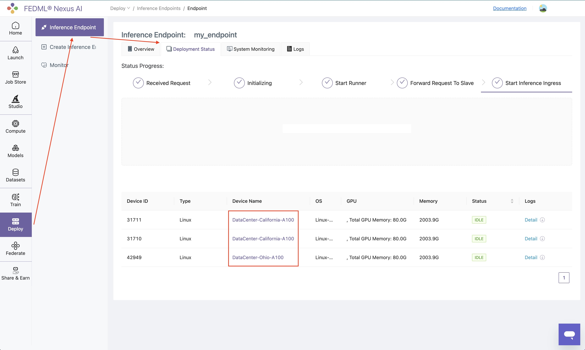
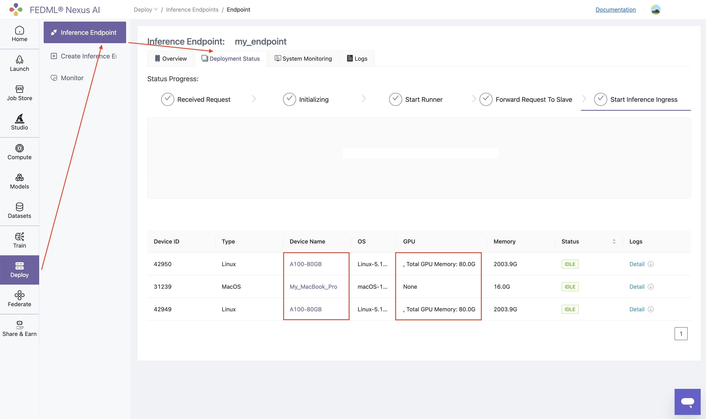

# Advanced Features
## Geo-distributed Model Deployment
Without building and configuring a complex Kubernetes Cluster. TensorOpera®Deploy can deploy models to nodes located
at multiple regions and manage the traffic routing automatically. 



## Heterogeneity Model Deployment
TensorOpera®Deploy can deploy models to different types of devices, such as CPU, GPU, TPU, etc. Whether it is a single
Macbook or a power A100, they can be connected together in an easy manner.




## Autoscaling and Fail-over
TensorOpera®Deploy can automatically scale up and down the number of replicas of the model deployment based on the QPS,
CPU, GPU, and memory usage. It can also automatically recover from failures through backup nodes.

If you want to scale out to more gpu nodes. Go to deploy -> Endpoint, click `Edit` button. 


Select / Unselect the devices that you want to make changes to. Then click `Submit` button.


## Multiple Return Type Support
### Streaming Response
The following code example can be found at:  
`https://github.com/FedML-AI/FedML/tree/master/python/examples/deploy/streaming_response`  

```python
def predict(self, *args, **kwargs):
        return {"my_output": "example output"}

async def async_predict(self, *args):
    return StreamingResponse(self._async_predict(*args))

async def _async_predict(self, *args) -> AsyncGenerator[str, None]:
    # This function can also return fastapi.responses.StreamingResponse directly
    input_json = args[0]
    question = input_json.get("text", "[Empty question]")
    for i in range(5):
        yield f"Answer for {question} is: {i + 1}\n\n"
        await asyncio.sleep(1.0)
```

In this example, we have a predictor that print a number every 1 second. The core part is that, apart from the original
`predict` method, which return json obj as usual. If the user put `"stream: true"` in their request body.   
e.g. `curl -XPOST xxx -d '{"text": "my input ...", "stream": true}'`, then TensorOpera will automatically call the
`async_predict`. So, to implement this, you will need to override this class method. The code above is an example 
returning a StreamingResponse, which take a AsyncGenerator as an input.

### File Response
The following code example can be found at:  
https://github.com/FedML-AI/FedML/blob/master/python/examples/deploy/stable_diffusion/src/inference_entry.py#L101

```python
def predict(self, request: dict, header=None):
    args = self.args
    input_dict = request
    prompt: str = input_dict.get("text", "").strip()

    self.args.prompt = [prompt]
    
    images, paths, pipeline_time = self.run_sd_xl_inference(warmup=False, verbose=args.verbose)
    
    if len(prompt) == 0:
        response_text = "<received empty input; no response generated.>"
    else:
        if header == "image/png":
            return str(paths[0])
        else:
            with open(paths[0], "rb") as image_file:
                encoded_string = base64.b64encode(image_file.read()).decode("utf-8")
                return encoded_string
```
In this example, we have a predictor that generate a file to a local directory `paths[0]`, here we have two ways to
return it to the requester. The first way is that, if the header of the request, if there exist `Accept: image/png`, 
then TensorOpera framework will parse the string that predictor's return, take it as a local file path, and use 
`fastapi.responses.FileResponse` to transfer this file to binary string and return it. The second way is that, if 
requester do not include `Accept: image/png` in their header. Then TensorOpera framework will treat the return obj from the 
predictor as a string, not file path. So in the user-level code, developer will need to transfer the file to base64 
string and return.
