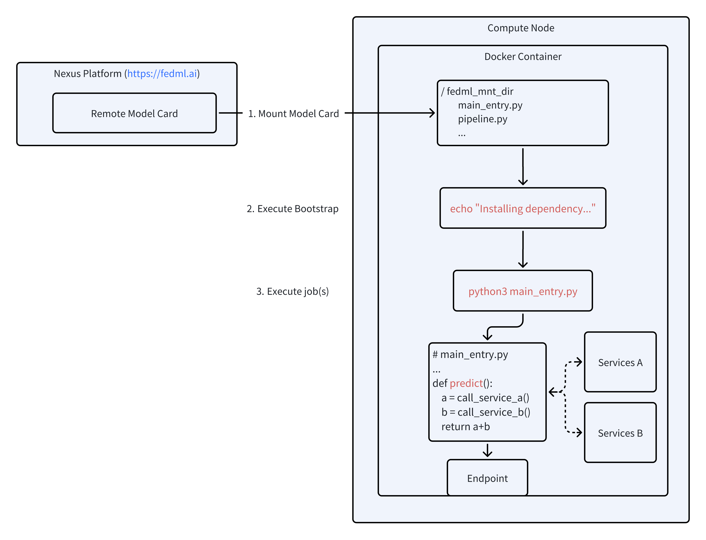

# Onboarding with Your Docker Image
Suppose you have read this section: [Create Model Card with YAML File](/docs/deploy/create_model.md#create-a-model-card-using-a-model-config-yaml-file) .
## Create Model Card with Existed Docker Image
In your `config.yaml` file, you can specify the `inference_image_name` field.
```yaml
inference_image_name: $your_image_name
```

Also, you should specify `enable_custom_image` to `true` in the `config.yaml` file.  

```yaml
enable_custom_image: true
```

Then, for the `bootstrap` key, you can write some command that install the requirements.

```yaml
bootstrap: |
  echo "Installing dependency..."
```

Finally, for the `job` key, you can write some command that start the inference service.

```yaml
job: |
  python3 main_entry.py
```


A graph of the procedure that FedML Library will internally do when you deploy this model card is shown below.

