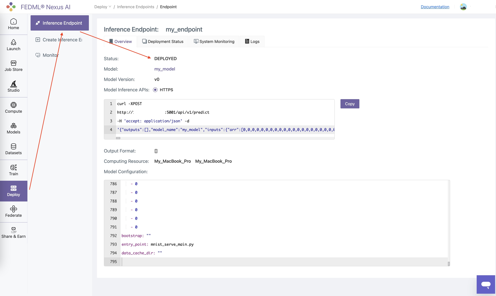
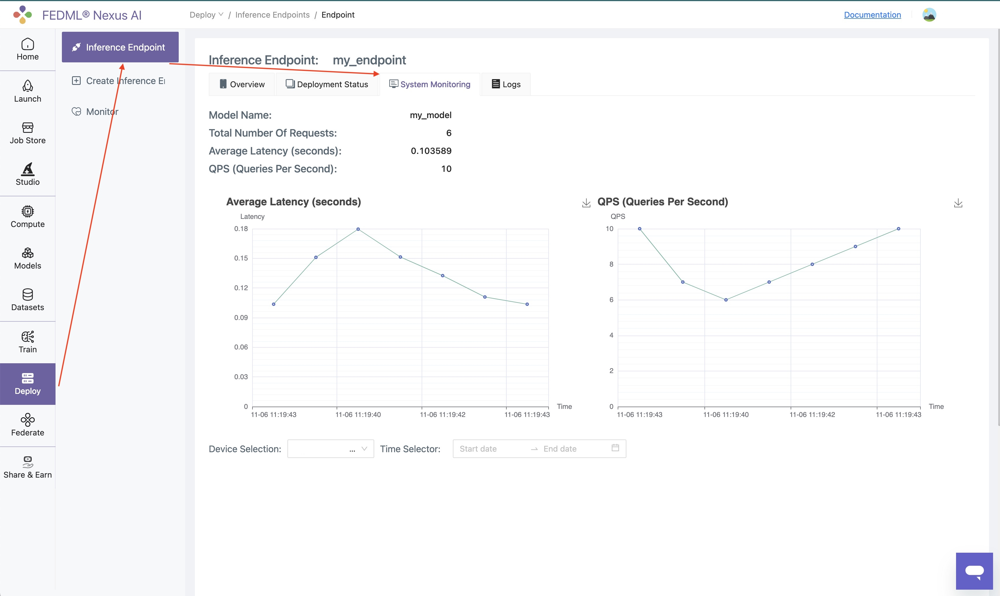

# Deploy to On-Premise

If you have your own on-premise servers, you can deploy the model cards to your own servers.

### Bind your devices to Nexus AI Platform
Bind your device to Nexus AI Platform.
```
fedml device bind $api_key
```
Check your device id from the output of the command line. Here the `31240` is the master device id, 
`31239` is the worker device id.
```bash
Congratulations, your device is connected to the FedML MLOps platform successfully!
Your FedML Edge ID is 32314, unique device ID is 0xxxxxxxx@MacOS.Edge.Device, 
master deploy ID is 31240, worker deploy ID is 31239
```

For single machine deploy, use one master id and one worker id.
```
fedml model deploy -n my_model -m 31240 -w 31239
```
After execute the command. You can then check the status of the deployment on Nexus AI Platform.


The System Performance (QPS, Latency, etc.) can be monitored on Nexus AI Platform.
