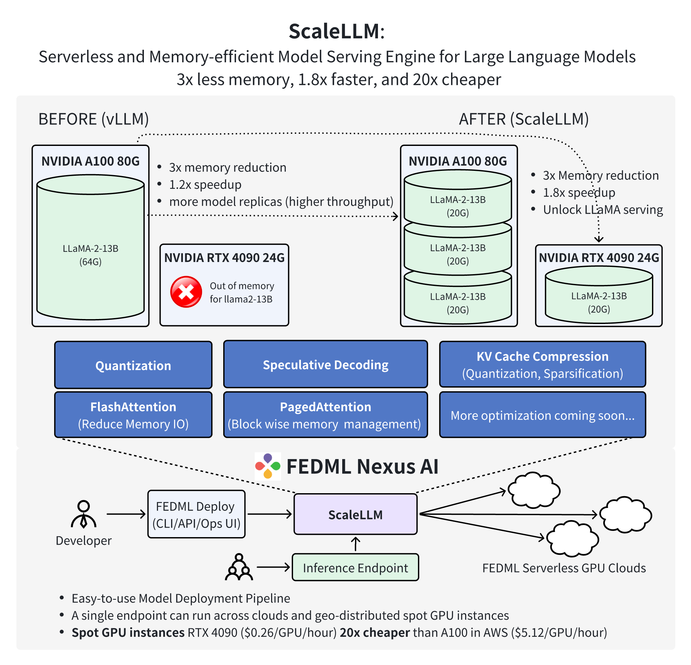

# ScaleLLM: Serverless and Memory-efficient Model Serving Engine for Large Language Models 

FEDML is thrilled to announce a significant milestone and a new era in Generative AI technology. We are excited to introduce ScaleLLM, a serverless and memory-efficient model serving engine for large language models (LLMs). With industrial-grade design and optimization of model inference techniques, including weight quantization, KV Cache quantization, fast attention, and fast decoding, ScaleLLM has achieved the following remarkable results:

- ScaleLLM can now host one LLaMA-2-13B-chat inference service on a single NVIDIA RTX 4090 GPU. The inference latency is up to 1.88 times lower than that of a single service using vLLM on a single A100 GPU.

- ScaleLLM can now host three LLaMA-2-13B-chat inference services on a single A100 GPU. The average inference latency for these three services is 1.21 times lower than that of a single service using vLLM on a single A100 GPU.

- In response to the demand for generating the first token after a prompt within 1 second, ScaleLLM has successfully migrated the inference service for LLaMA-2-13B-chat to a single L4 or T4 GPU. Such a fast response time can significantly improve the quality of experience for the end users.

These achievements demonstrate the advanced capability of ScaleLLM in reducing the cost of LLM inference to 20x cheaper than A100 on AWS.

Thanks to the memory optimization offered by ScaleLLM, developers can now smoothly deploy AI models across a decentralized network of consumer-grade GPUs. To facilitate this, we further introduce the FEDML Nexus AI platform (https://fedml.ai). Nexus AI delivers comprehensive APIs, CLIs, and a user-friendly operational UI, empowering scientists and engineers to scale their model deployments on decentralized on-demand instances. Notably, these deployed endpoints can span multiple GPU instances, complete with failover and fault-tolerance support.

ScaleLLM, in conjunction with the Nexus AI platform, marks a paradigm shift in the methodology of AI model deployment. It equips developers with the ability to seamlessly deploy AI models across a decentralized network of consumer-grade GPUs, including models such as RTX 4090 and RTX 3090. Beyond the computational efficiency this approach offers, it also provides significant cost advantages, being 20 times more economical compared to similar services like AWS. This blend of functionality and affordability positions it as a revolutionary force in the AI deployment arena.

For more details, please read the blog: https://blog.fedml.ai/scalellm-unlocking-llama2-13b-llm-inference-on-consumer-gpu-rtx-4090-powered-by-fedml-nexus-ai/
