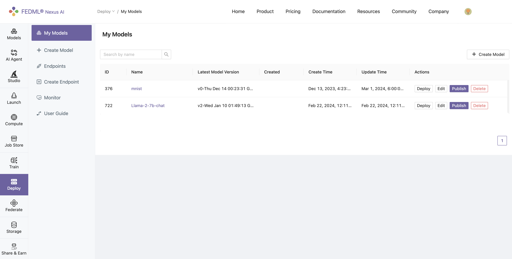
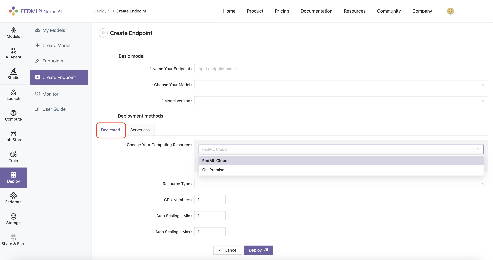
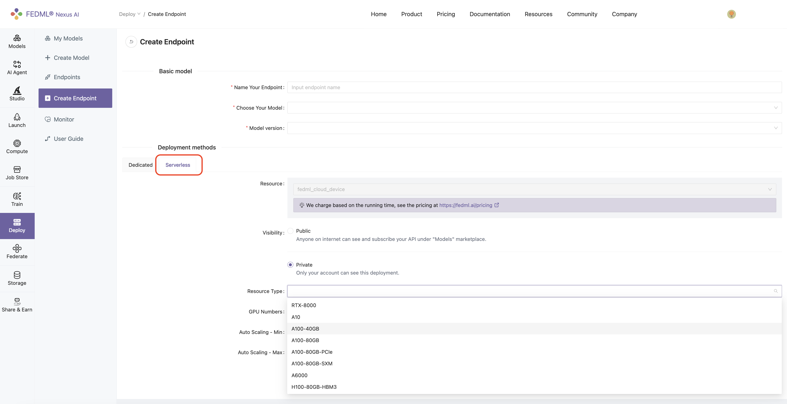

# Deploy Federated Models as Endpoints on NexusAI

During the execution of an FL job, all the global (aggregated) models are stored on the NexusAI platform. Once the FL job is complete, you can deploy any of the stored global models for inference with just one-click either on one of the available resources of **FedML Cloud** or your own devices, i.e., **On-Premise**. To accomplish this, navigate to the Deploy tab, select the model and click the `Publish` button.

After publishing, you will be redirected to the Create Endpoint tab from where you can specify the name of the endpoint, the version of the model and its resource requirements. For defining the deployment method, there are two deployment type methods: **Dedicated** or **Serverless**. When selecting **Dedicated** you can choose your computing resource to be either **FedML Cloud** or **On-Premise**. Essentially, through the **FedML Cloud** option the desired endpoint will be deployed on computing resources hosted by FedML Cloud, while **On-Premise** refers to computing resources that you own and manage. 

**Dedicated (FedML Cloud):** When selecting the FedML Cloud option, you can pick the computing type that has been bounded to your account from the available resources in the `Resource Type` drop down list, e.g., A100, H100, RTX-4090.

**Dedicated (On-Premise)**: When selecting the On-Premises option, you need to select one Master server and (unlimited) Worker servers from the devices that you have registered with your account, namely the devices (machines) where you have performed the `fedml login` command.

**Serverless (FedML Cloud):** Instead of selecting a specific resource type that has been bounded to your account, you can select any resource type from the available resource types in FedML Cloud.

Finally, you need to specify the number of GPU devices you will need for deploying the endpoint as well as the minimum and maximum size of the instance group within which the autoscaler service will operate.