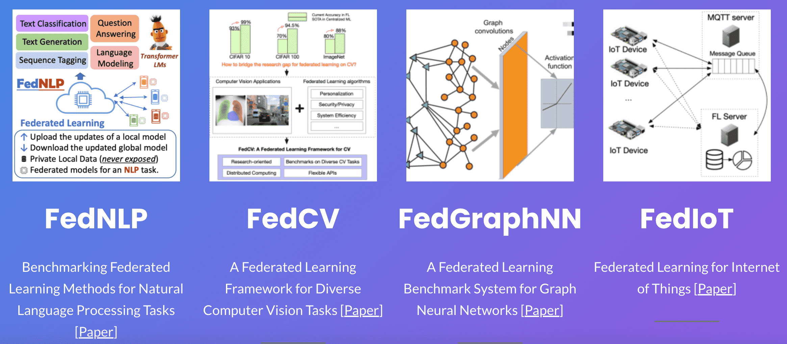

import APIOverview from './_static/image/apioverview.jpg';
import MLOps_workflow from './_static/image/MLOps_workflow.png';
import MLOps_invite from './_static/image/mlops_invite.png';

# Getting Started

In this guide, we provide a short overview of the FEDML® Open Source library as well as how to interact with the FEDML® Nexus AI platform (MLOps platform) for submitting federated learning workflows:

- FedML Open Source Library: https://github.com/FedML-AI/FedML 
- MLOps Platform: https://nexus.fedml.ai


## **FEDML® Federate Features**

FEDML® Federate aims to facilitate the development and deployment of distributed and federated machine learning applications. To achieve this, FEDML® Federate offers a simple, intuitive, extensible and versatile API for quickly developing and executing distributed and machine learning workflows in both simulated and real-world setting. In particular, Fed


- **FedML Federate Simulation** - Simulating federated learning in the real world: (1) simulate FL using a single process (2) MPI-based FL Simulator (3) NCCL-based FL Simulator (fastest)
- **FedML Fedeate Cross-silo** - Cross-silo Federated Learning for cross-organization/account training, including Python-based edge SDK.
- **FedML Federate Smartphones** - Cross-device Federated Learning for Smartphones and IoTs, including edge SDK for Android/iOS and embedded Linux.
- **FedML Nexus AI - Federate**: FedML's federated learning operation pipeline for AI running anywhere and at any scale.

## **Open Source Library Quickstart**

### Installation

Installing the FedML library on your machine is as simple as follows:

```Python
pip install fedml
```

For more detailed and advanced installation methods, please refer to the [installing FedML](./../open-source/installation) guide.

### API Overview

Our design philosophy behind FedML's Open Source API is to minimize the number of API endpoints required to define and execute federated learning workloads. To this extend, we have designed the library to consist of eight core Python modules:

<center>
 
</center>

Each module features a unique package entry point (e.g., `fedml.cross-silo`) to manage related APIs from where the FedML users can wrap these APIs to meet their specific needs.


### One-Liner
As you can see below, we can run the FedML Parrot (simulator) with a one-line API command as follows: 

```python
# main.py

import fedml

if __name__ == "__main__":
    fedml.run_simulation()
```

```
python main.py
```

After running the above script, you will see the following output:

```
[FedML-Server(0) @device-id-0] [Sun, 01 May 2022 14:59:28] [INFO] [__init__.py:30:init] args = {'yaml_config_file': '', 'run_id': '0', 'rank': 0, 'yaml_paths': ['/Users/chaoyanghe/opt/anaconda3/envs/mnn37/lib/python3.7/site-packages/fedml-0.7.8-py3.7.egg/fedml/config/simulation_sp/fedml_config.yaml'], 'training_type': 'simulation', 'using_mlops': False, 'random_seed': 0, 'dataset': 'mnist', 'data_cache_dir': './data/mnist', 'partition_method': 'hetero', 'partition_alpha': 0.5, 'model': 'lr', 'federated_optimizer': 'FedAvg', 'client_id_list': '[]', 'client_num_in_total': 1000, 'client_num_per_round': 10, 'comm_round': 200, 'epochs': 1, 'batch_size': 10, 'client_optimizer': 'sgd', 'learning_rate': 0.03, 'weight_decay': 0.001, 'frequency_of_the_test': 5, 'using_gpu': False, 'gpu_id': 0, 'backend': 'single_process', 'log_file_dir': './log', 'enable_wandb': False}
[FedML-Server(0) @device-id-0] [Sun, 01 May 2022 14:59:28] [INFO] [device.py:14:get_device] device = cpu
[FedML-Server(0) @device-id-0] [Sun, 01 May 2022 14:59:28] [INFO] [data_loader.py:22:download_mnist] ./data/mnist/MNIST.zip
[FedML-Server(0) @device-id-0] [Sun, 01 May 2022 14:59:31] [INFO] [data_loader.py:57:load_synthetic_data] load_data. dataset_name = mnist
...
```

To run more advanced simulation use cases (e.g, using MPI), further tuning the federated environment and model hyper-parameters (i.e., configuring the `fedml_config.yaml` file) and further customizing simulated workloads, please refer to the [simulation page](./simulation/overview.md) and the [examples](../simulation/examples) therein.

### One-Liner Expansion
Here, we demonstrate how the one-line API can be expanded into five API lines. To illustrate this, we will use the FedML Octopus (cross-silo federated learning) [library as an example](https://github.com/FedML-AI/FedML/tree/master/python/examples/federate/cross_silo/mqtt_s3_fedavg_mnist_lr_example). In this example, the FL Client APIs are as follows:

```python
import fedml
from fedml import FedMLRunner

if __name__ == "__main__":
    args = fedml.init()

    # init device
    device = fedml.device.get_device(args)

    # load data
    dataset, output_dim = fedml.data.load(args)

    # load model
    model = fedml.model.create(args, output_dim)

    # start training
    FedMLRunner(args, device, dataset, model).run()
```

Using these APIs, we only need to tune the hyper-parameters through the configuration file `fedml_config.yaml`. For instance:

```yaml
common_args:
  training_type: 'cross_silo'
  scenario: 'horizontal'
  using_mlops: false
  random_seed: 0

environment_args:
  bootstrap: config/bootstrap.sh

data_args:
  dataset: 'mnist'
  data_cache_dir: ~/fedml_data
  partition_method: 'hetero'
  partition_alpha: 0.5

model_args:
  model: 'lr'
  model_file_cache_folder: './model_file_cache' # will be filled by the server automatically
  global_model_file_path: './model_file_cache/global_model.pt'

train_args:
  federated_optimizer: 'FedAvg'
  client_id_list:
  client_num_in_total: 1
  client_num_per_round: 2
  comm_round: 10
  epochs: 1
  batch_size: 10
  client_optimizer: sgd
  learning_rate: 0.03
  weight_decay: 0.001

validation_args:
  frequency_of_the_test: 1

device_args:
  worker_num: 2
  using_gpu: false
  gpu_mapping_file: config/gpu_mapping.yaml
  gpu_mapping_key: mapping_default

comm_args:
  backend: 'MQTT_S3'
  mqtt_config_path: config/mqtt_config.yaml
  s3_config_path: config/s3_config.yaml
  # If you want to use your customized MQTT or s3 server as training backends, you should uncomment and set the following lines.
  #customized_training_mqtt_config: {'BROKER_HOST': 'your mqtt server address or domain name', 'MQTT_PWD': 'your mqtt password', 'BROKER_PORT': 1883, 'MQTT_KEEPALIVE': 180, 'MQTT_USER': 'your mqtt user'}
  #customized_training_s3_config: {'CN_S3_SAK': 'your s3 aws_secret_access_key', 'CN_REGION_NAME': 'your s3 region name', 'CN_S3_AKI': 'your s3 aws_access_key_id', 'BUCKET_NAME': 'your s3 bucket name'}

tracking_args:
  # When running on MLOps platform (nexus.fedml.ai), the default log path is at ~/fedml-client/fedml/logs/ and ~/fedml-server/fedml/logs/
  enable_wandb: false
```

### Examples
Below, you can find some useful examples on how the FedML library simplifies setting up and running federated learning in diverse real-world settings.

#### FedML Parrot Examples

- **Simulation with a Single Process (Standalone):** This approach runs a simulated federated learning environment in your personal laptop or server using a single process. The example provided in [sp_fedavg_mnist_lr_example](./simulation/examples/sp_fedavg_mnist_lr_example.md) is a great start for researchers, who want to quickly try an algorithmic idea in small synthetic datasets (MNIST, shakespeare, etc.) and small models (ResNet-18, Logistic Regression, etc.).
  

- **Simulation with Message Passing Interface (MPI):** The MPI-based approach allows to run a simulated federated learning environment across/cross- GPU/CPU servers. To get started, please have a look at the following introductory example: [mpi_torch_fedavg_mnist_lr_example](./simulation/examples/mpi_torch_fedavg_mnist_lr_example.md).
  

- **Simulation with NCCL-based MPI (Fastest Training):**: If your cross-GPU bandwidth is high (e.g., InfiniBand, NVLink, EFA, etc.), the NCCL-based MPI simulator is a great alternative to spawn a simulated federated environment and accelerate your application development. 

#### FedML Octopus Examples

- **Horizontal Federated Learning:** The example provided in [mqtt_s3_fedavg_mnist_lr_example](./cross-silo/example/mqtt_s3_fedavg_mnist_lr_example.md) shows an easy to follow and a good introductory workflow to understand and develop applications in the context of horizontal federated learning.

- **Hierarchical Federated Learning:** The example provided in [mqtt_s3_fedavg_hierarchical_mnist_lr_example](./cross-silo/example/mqtt_s3_fedavg_hierarchical_mnist_lr_example.md) is a great example for understanding how to run hierarchical federated learning across data silos (hospitals, banks, etc.). In the example above, `hierarchical` implies that each federated learning client (i.e., data silo) has multiple GPUs that can run local distributed training with PyTorch DDP, and the federated learning server then aggregates globally the results received from all clients.
  

#### FedML Beehive Examples

- FedML supports training across multiple mobile devices. Please refer to the detailed guide provided in the [Federated Learning on Android Smartphones](./cross-device/tutorial.md) on how to get started.

## **MLOps User Guide**
By enabling zero-code, lightweight, cross-platform, and provably secure and private federated learning, the FedML MLOps Platform simplifies the deployment workflow of federated learning applications from anywhere and at any scale. It is important to note that, any project developed based on FedML Octopus (cross-silo) and FedML Beehive (cross-device) can be smoothly deployed into the real-world system using the [FedML MLOps](https://nexus.fedml.ai) platform. For a more detailed guide on how to use the MLOps platform please have a look at the [FEDML Nexus AI User Guide](./cross-silo/user_guide.md).


### Simulation Migration
The figure below shows how a local simulation workflow is **migrated and deployed in real-world settings** when submitted through the MLOps' Web UI. In a nutshell, users need to upload the bundled server and client code packages to the MLOps platform, login to their FedML account and invite and/or select collaborators to form a federation for running the federated learning workflow. The MLOps platform will take care to seamlessly execute the workflow and perform the automatic deployment and scaling of resources.

<center>
 
</center>


### Step-by-Step Walkthrough
Please refer to the video below for a **step-by-step** walkthrough of the FedML platform.

<center>
 <a href="https://www.youtube.com/watch?v=E1k05jd1Tyw"></a>
</center>


## **More Resources**

### References

```
@article{chaoyanghe2020fedml,
  Author = {He, Chaoyang and Li, Songze and So, Jinhyun and Zhang, Mi and Wang, Hongyi and Wang, Xiaoyang and Vepakomma, Praneeth and Singh, Abhishek and Qiu, Hang and Shen, Li and Zhao, Peilin and Kang, Yan and Liu, Yang and Raskar, Ramesh and Yang, Qiang and Annavaram, Murali and Avestimehr, Salman},
  Journal = {Advances in Neural Information Processing Systems, Best Paper Award at Federate Learning Workshop},
  Title = {FedML: A Research Library and Benchmark for Federated Machine Learning},
  Year = {2020}
}
```

### Ecosystem



The FedML Ecosystem facilitates federated learning research and productization in diverse application domains. With the foundational support from FedML Core Framework, it supports FedNLP (Natural Language Processing), FedCV (Computer Vision), FedGraphNN (Graph Neural Networks), and FedIoT (Internet of Things).
Please read this [guidance](./examples.md) for details

### Publication

FedML’s core technology is backed by years of cutting-edge research represented in <b>50+ publications</b> in ML/FL Algorithms, Security/Privacy, Systems, and Applications.

1. Vision Paper for High Scientific Impacts
2. System for Large-scale Distributed/Federated Training
3. Training Algorithms for FL
4. Security/privacy for FL
5. AI Applications
   A Full-stack of Scientific Publications in ML Algorithms, Security/Privacy, Systems, Applications, and Visionary Impacts

Please check out [the full publication list](./tech/papers.md) for details.

### Invited Talks (Videos)

- [Trustworthy and Scalable Federated Learning](https://www.youtube.com/watch?v=U3BiuWjhdaU). Federated Learning One World Seminar (FLOW). By Salman Avestimehr

- [Distributed ML for Federated Learning feat](https://www.youtube.com/watch?v=AY7pCYTC8pQ). Aiden Chaoyang He. Stanford MLSys Seminar. By Aiden Chaoyang He

- [Contributed Talk for FedML Library](https://www.youtube.com/watch?v=93SETZGZMyI). Best Paper Award at NeurIPS 2020 Federated Learning Workshop. By Aiden Chaoyang He

