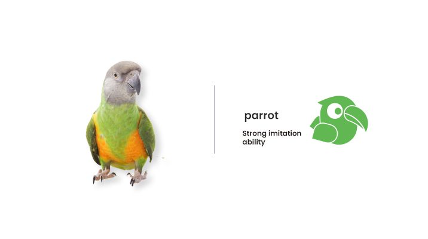
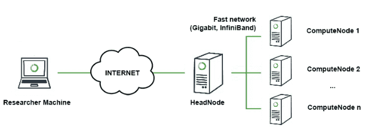

# Simulation Overview



FEDML Federate Simulation is also called Parrot, named after the beloved pet which mimics human speech, helps researchers and engineers to try new algorithms before deploying FL into real world. 
Compared to other simulators, FedML Parrot brings additional values as follows:
1. <b>mitigating the gap between research and engineering</b>: before convincing your ML infrastructure team to do non-trivial algorithmic and system upgrades, you can use FedML Parrot to demonstrate the benefits of newly developed federated learning algorithms or applying FL to your existing ML applications. FedML Parrot can smoothly transplant your simulation code to real-world deployment with our MLOps platform (open.fedml.ai). This has been demonstrated by real business use cases served by FedML Inc.

2. <b>simplifying your research</b>: ML researchers can  try quick algorithmic ideas without handling tedious engineering. For example, Dr. Aiden Chaoyang He. has published 30+ FL-related publications using the FedML framework in just 2-3 years.

3. <b>teaching with tangible live demo</b>: professors can use FedML Parrot to teach students the FL algorithmic skeleton without needing large-scale GPU resources. If you are a professor, please don't hesitate to use FedML.

In the simulation environment, FedML Parrot assumes that you have the infrastructure as shown in the following figure. You can run your experiments in your laptop or the cluster. 



## Outline
- Installation
- Dataset and Models
- Algorithm Reference Implementations
- Benchmark
- Config MLOps parameters
- Login to MLOps
- Examples

## Installation
```
pip install fedml
```
For more installation methods, please follow instructions at [installing FedML](./../../open-source/installation/installation.md).

## Algorithm Reference Implementation
FedML®Federate Simulation supports representative algorithms in different communication topologies (as the figure shown below), including Fedvg, FedOpt (ICLR 2021), FedNova (NeurIPS 2020), FedGKT (NeurIPS 2020), Decentralized FL, Vertical FL, Hierarchical FL, FedNAS, and Split Learning.


For more details, please read [Algorithm Reference Implementation](./api.md).


## Datasets and Models


FedML supports comprehensive research-oriented (synthetic and public) FL datasets and models, including four representative synthetic FL datasets used by top-tier publications:


 - **[EMNIST](https://github.com/FedML-AI/FedML/tree/master/data/FederatedEMNIST)**:
EMNIST dataset extends MNIST dataset with upper and lower case English characters. 


- **[CIFAR-100](https://github.com/FedML-AI/FedML/tree/master/data/fed_cifar100)**:
CIFAR-100 dataset consists of 100 image classes with each containing 600 images. 

- **[Shakespeare](https://github.com/FedML-AI/FedML/tree/master/data/fed_shakespeare)**:
Shakespeare dataset is built from the collective works of William Shakespeare. 

- **[Stack Overflow](https://github.com/FedML-AI/FedML/tree/master/data/stackoverflow)**:
Stack Overflow dataset originally hosted by Kaggle consists of questions and answers from the website Stack Overflow. This dataset is used to perform two tasks: tag prediction via logistic regression and next word prediction. 

For a comprehensive dataset and model list, please visit [Datasets and Models](./../datasets-and-models.md).

## Customizing Data Loader for Your Own Dataset
You may need to plugin new datasets into FedML framework. Please follow instructions at [Customizing Data Loader for Your Own Dataset](./../data_loader_customization.md).


## Benchmark
To do a sanity check of FedML Parrot in your environment or to fairly compare newly developed algorithms with baselines, please refer to benchmarking results at:
- [Benchmarking results for single process-based federated learning](./benchmark/BENCHMARK_simulation.md)

- [Benchmarking Results for MPI-based federated learning](./benchmark/BENCHMARK_MPI.md)


# Config MLOps parameters
You may set the following parameters in the 'fedml_config.yaml' file
to upload metrics and logs to MLOps (open.fedml.ai)
```
enable_tracking: true
mlops_api_key: your_api_key
mlops_project_name: your_project_name
mlops_run_name: your_run_name_prefix
```

# Login to MLOps
You may run the following command to login to MLOps (open.fedml.ai), 
then simulation metrics and logs will be uploaded to MLOps.
```
fedml login userid(or API Key) -c -r edge_simulator
``` 

## Examples
FedML Parrot provides rich, well-documented examples for you to get started: [Simulation Examples](./examples.md).
