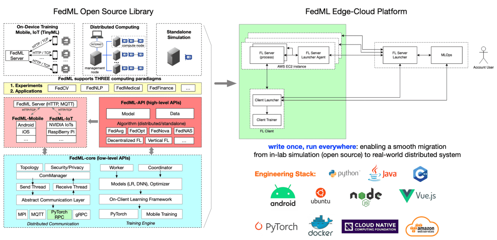
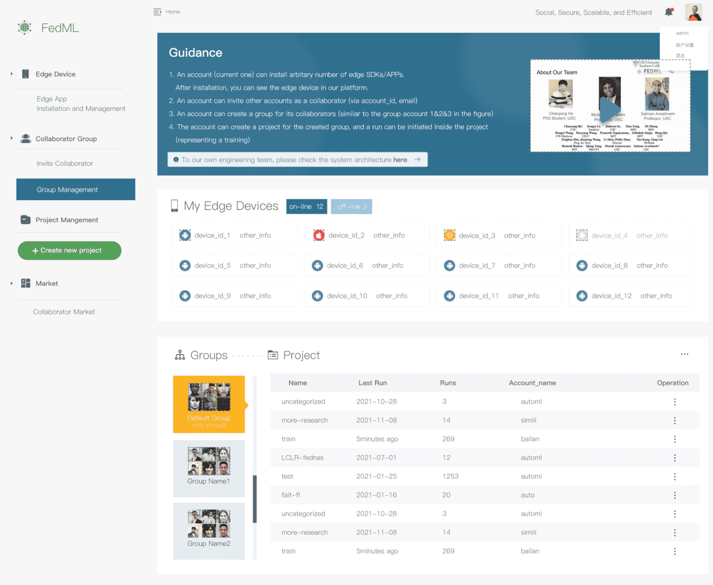
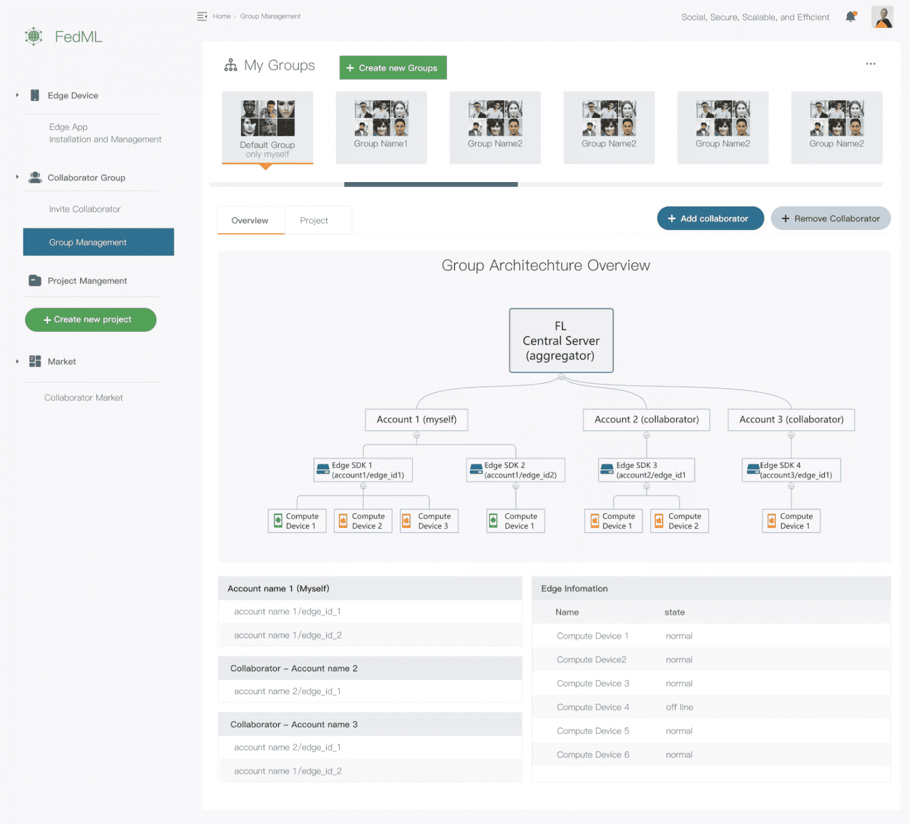

# Overview

FedML's core technology is backed by years of cutting-edge research represented in 50+ publications in ML/FL Algorithms, Security/Privacy, Systems, and Applications, as well as 10 years of industrial experience in Distributed Systems, Cloud Computing, and Mobile/IoT Systems.

## 1. A Full-stack of Scientific Publications in ML Algorithms, Security/Privacy, Systems, Applications, and Visionary Impacts

- Vision Paper for High Scientific Impacts

- System for Large-scale Distributed/Federated Training

- Training Algorithms for FL

- Security/privacy for FL

- AI Applications

Please check out [this publication list](./papers.md) for details.

## 2. Industrial-level System Design and Optimization

- FedML Open Source Library ([https://github.com/FedML-AI](https://github.com/FedML-AI))
- FedML Edge SDK and MLOps Platform ([https://fedml.ai](https://fedml.ai))

The software architecture of the open-source library is on the left side.
MLOps platform further reuses the source code of the open-source library (the green-colored box).

## 3. User-friendly MLOps platform to simplify collaboration and real-world deployment

