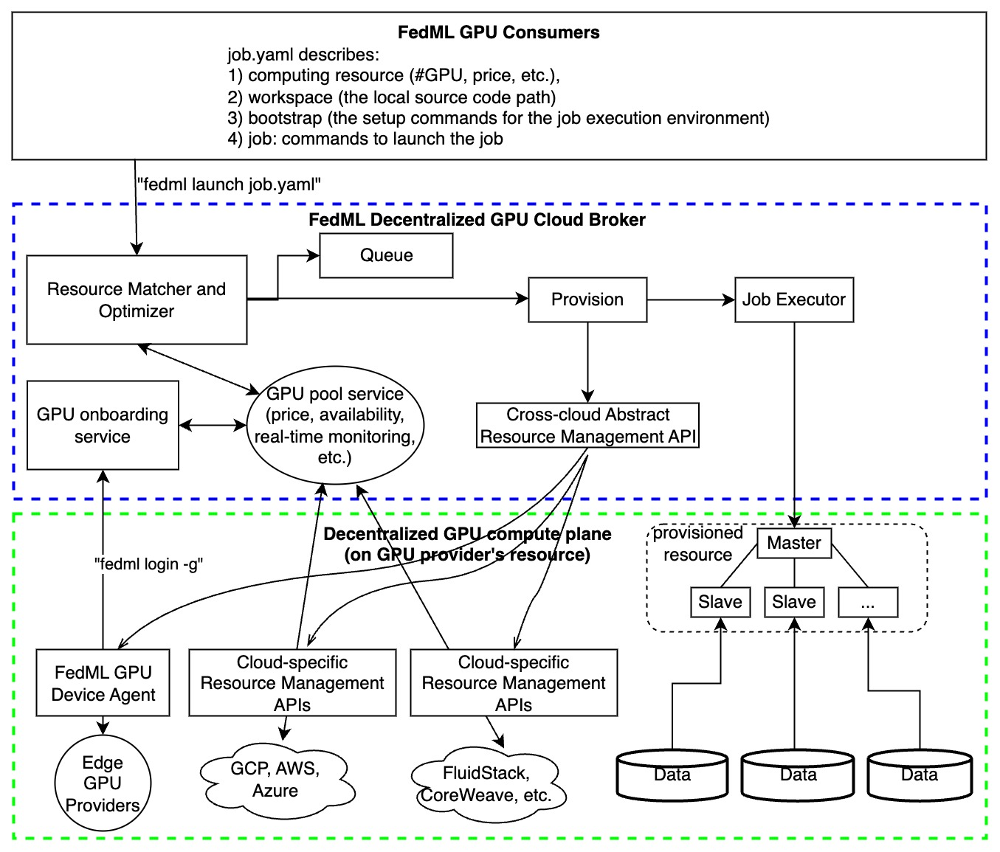

# What is TensorOpera® Launch?

No servers? No problem! Tap into a massive GPU marketplace (multi-cloud and multi-provider), offering high availability and low cost, to effortlessly launch your intricate ML jobs with a one line command:
```
fedml launch your_job.yaml
```
where the Job YAML `your_job.yaml` defines the computing resource requirement and your source code workspace (code path). 

Launch swiftly pairs AI jobs with the most economical GPU resources, auto-provisions, and effortlessly runs the job, eliminating complex environment setup and management. It supports a range of compute-intensive jobs for generative AI and LLMs, such as large-scale training, serverless deployments, and vector DB searches. TensorOpera® Launch also facilitates on-prem cluster management and deployment on private or hybrid clouds.



TensorOpera® Launch works as following consecutive actions:

1. define your ML job without code change in a declarative format (e.g., YAML) or reuse our pre-built job templates ->
2. launch your ML job with just one-line CLI or one-click in GUI
3. search for cheaper GPUs across a large number of GPU providers without price lock-in
4. provision automatically for your GPU resources and the software environment setup tailored for your job
5. manage cluster for concurrent jobs with job queue support
5. orchestrate your ML job across multi-nodes/geo-distributed environments, it can be model deployment across GPU nodes, distributed training, or even federated learning across clouds.
6. run and monitor your job with rich observability features so you can see the real-time billing, metrics, logs, system performances, as well as diagnose performance bottleneck by fine-grained profiling.
7. share and earn - contribute your idle GPUs to the launch GPU marketplace and earn $.

The value proposition of TensorOpera® Launch:

1. Find the lower prices without cloud vendor lock-in, in any clouds
2. The highest GPU availability, provision in all zones/regions/clouds, even individual GPU contributors from the community
3. Define your scheduling strategies to save money or request resources in a higher priority
4. User-friendly MLOps to save time on environment management (AI docker hub for developers)
5. On-premises GPU cluster management
6. Provide Machine Learning as a Service (MLaaS) with Launch: if you have GPU resources, valuable datasets, or even a foundation model and hope to provide cloud service for your own customers to use them as Inference API or Training As a Service, TensorOpera Launch would be the off-the-shelf enterprise solution for it. Please contact us to discuss the deployment. 
7. TensorOpera® Launch is versatile in any AI jobs, including training, deployment, and federated learning. It can also be used for complex multi-step jobs such as serving AI agents, building a customized machine learning pipeline for model continual refinement. 