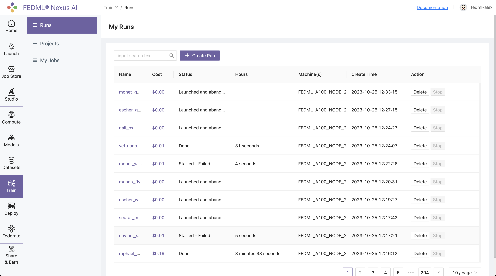
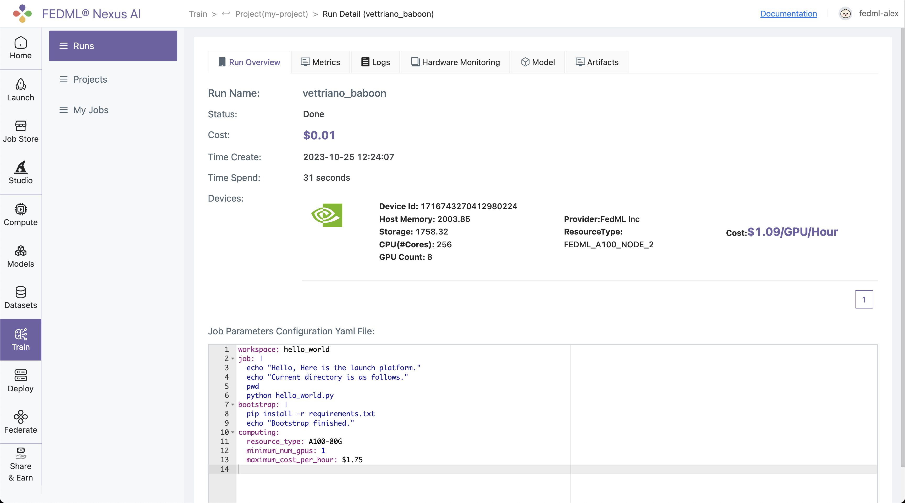
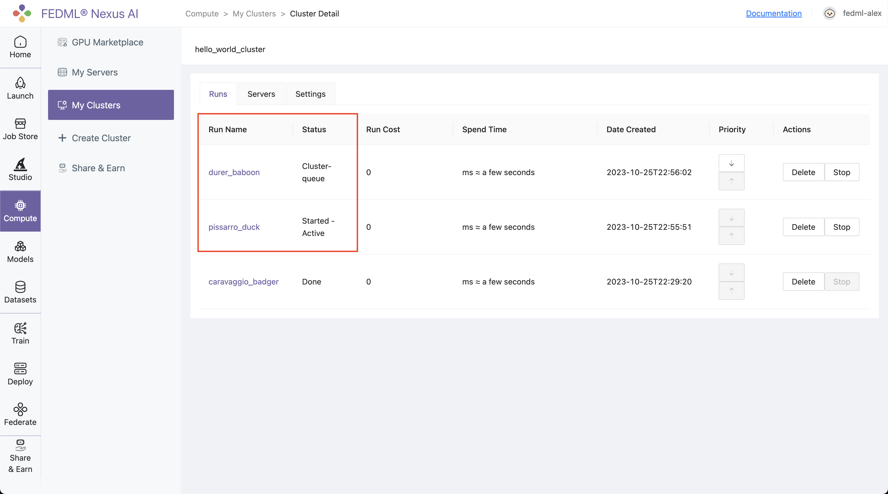

# Launch on Cloud Cluster

## 1. Set up the fedml library
Install Python library for interacting with FedML® Launch APIs.

```bash
pip install fedml
```

## 2. Create job.yaml file
Before launch any job, at first, you need to define your job properties in the job yaml file, e.g. workspace, job, bootstrap, etc.

:::tip Tip
The workspace folder is the folder where your source code for execution resides
:::

Below is an example of job yaml file:

```yaml title="job.yaml"
fedml_env:
  project_name: my-project
  
# Local directory where your source code resides.
# It should be the relative path to this job yaml file.
# If your job doesn't contain any source code, it can be empty.
workspace: hello_world

# Bootstrap shell commands which will be executed before running entry commands.
# Support multiple lines, which can be empty.
bootstrap: |
  pip install -r requirements.txt
  echo "Bootstrap finished."


# Running entry commands which will be executed as the job entry point.
# If an error occurs, you should exit with a non-zero code, e.g. exit 1.
# Otherwise, you should exit with a zero code, e.g. exit 0.
# Support multiple lines, which can not be empty.
job: |
    echo "Hello, Here is the launch platform."
    echo "Current directory is as follows."
    pwd
    python hello_world.py
  

computing:
  minimum_num_gpus: 1      # minimum # of GPUs to provision
  # max cost per hour of all machines for your job.
  # E.g., if your job are assigned 2 x A100 nodes (8 GPUs), each GPU cost $1/GPU/Hour, "maximum_cost_per_hour" = 16 * $1 = $16
  maximum_cost_per_hour: $1.75
  resource_type: A100-80G       # e.g., A100-80G, please check the resource type list by "fedml show-resource-type" or visiting URL: https://nexus.fedml.ai/accelerator_resource_type
```

:::tip Tip
Directory structure of `hello_world` example
```
tree -l

/example
├── hello_world
|  ├── hello_world.py
├── job.yaml
```
:::


## 3. Launch a job on a cluster cloud
Launch a job to the GPU Cloud Cluster.

> **_NOTE:_** Note that you might be prompted for **API_KEY** the first time you run the command. Please get this key from your account on FedML® AI Nexus Platform. You can also specify the API_KEY with the `-k` option.

```bash
fedml launch /path/to/job.yaml -c cluster my_cluster
```

> **_NOTE:_** If a cluster with the specified name does not exist, a new one will be created for you (provided the required resources are both available and matched for your request). 
> Once the cluster is established, the resources will remain locked in for this cluster till you tear the cluster down and will be utilized for any subsequent tasks initiated under the same cluster name.


After the launch CLI is executed, you will get the following output prompting for confirmation of resources:

```
Submitting your job to FedML® Nexus AI Platform: 100%|██████████████████████████████████████████████████████████████████████████████████████████████████████████████████████████████████████████████████████████| 2.92k/2.92k [00:00<00:00, 4.87kB/s]

Searched and matched the following GPU resource for your job:
+-----------+-------------------+---------+------------+-------------------------+---------+------+----------+
|  Provider |      Instance     | vCPU(s) | Memory(GB) |          GPU(s)         |  Region | Cost | Selected |
+-----------+-------------------+---------+------------+-------------------------+---------+------+----------+
| FedML Inc | FEDML_A100_NODE_2 |   256   |  2003.85   | NVIDIA A100-SXM4-80GB:8 | DEFAULT | 1.09 |    √     |
+-----------+-------------------+---------+------------+-------------------------+---------+------+----------+

You can also view the matched GPU resource with Web UI at:
https://open.fedml.ai/train/project/run?projectId=1717276102352834560&runId=1717307383354626048
Do you want to launch the job with the above matched GPU resource? [y/N]:
```

You can either confirm through terminal or may even open the run url to confirm.
Once resources are confirmed, it will then create a cluster out of these matched resources, run your job, and you will get the following output:

```
Do you want to launch the job with the above matched GPU resource? [y/N]: y

You can track your run details at this URL:
https://open.fedml.ai/train/project/run?projectId=1717276102352834560&runId=1717307383354626048

For querying the realtime status of your run, please run the following command.
fedml run logs -rid 1717307383354626048
```

## 4. Realtime status of your run
You can query the realtime status of your run with the following command.

```bash
fedml run logs -rid <run_id>
```

More run management CLIs can be found [here](/open-source/cli/fedml-run)

## 5. You can also view the details of run on the FedML® AI Nexus platform:

Log into to the FedML® AI Nexus Platform (https://nexus.fedml.ai) and go to `Train > Projects (my_project)`
Select the run you just launched and click on it to view the details of the run.


Alternatively, you can also go to `Train / Runs` to find all of your runs scattered across all of your projects unified at a single place.



:::tip Tip
The url link to FedML® AI Nexus Platform for your run is printed in the output of the launch command for quick reference.

```bash
You can track your run details at this URL:
https://open.fedml.ai/train/project/run?projectId=1717276102352834560&runId=1717307383354626048

For querying the realtime status of your run, please run the following command.
fedml run logs -rid 1717307383354626048
```

This is the quickest, one-click way to go to your run UI.
:::


The Run UI offers a lot of information about your run including Metrics, Logs, Hardware Monitoring, Model, Artifacts, as shown in the image below:



# 6. Run concurrent jobs on cluster.

You can run as many consequent jobs as you like on your cluster now. It will queue the jobs and by default run in the order of submission.

```bash
❯ fedml launch job_1.yaml -v dev -c hello_world_cluster
Submitting your job to FedML® Nexus AI Platform: 100%|██████████████████████████████████████████████████████████████████████████████████████████████████████████████████████████████████████████████████████████| 2.92k/2.92k [00:00<00:00, 17.4kB/s]

You can track your run details at this URL:
https://open-dev.fedml.ai/train/project/run?projectId=1717276102352834560&runId=1717314053350756352

For querying the realtime status of your run, please run the following command.
fedml run logs -rid 1717314053350756352 -v dev
```

```bash
❯ fedml launch job_2.yaml -v dev -c hello_world_cluster
Submitting your job to FedML® Nexus AI Platform: 100%|██████████████████████████████████████████████████████████████████████████████████████████████████████████████████████████████████████████████████████████| 2.92k/2.92k [00:00<00:00, 11.8kB/s]

You can track your run details at this URL:
https://open-dev.fedml.ai/train/project/run?projectId=1717276102352834560&runId=1717314101526532096

For querying the realtime status of your run, please run the following command.
fedml run logs -rid 1717314101526532096 -v dev
```

###### Jobs are queued in the order of submission but can also be preempted using the up and down arrows. 



:::tip Tip
The Run Name on the Cluster page links straight to the Run UI which gives you detailed info on Run Metrics, Logs, Hardware Monitoring, Model, Artifacts, etc.
:::


