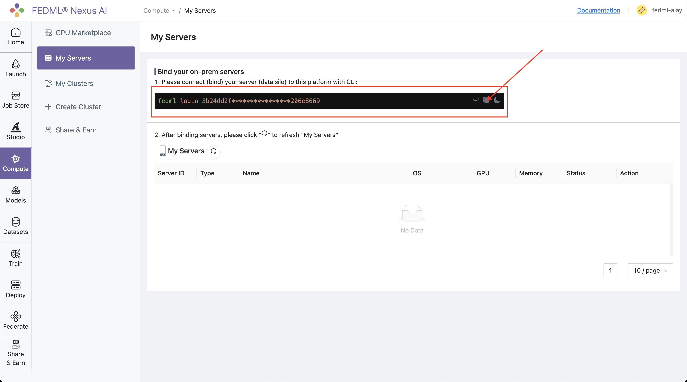
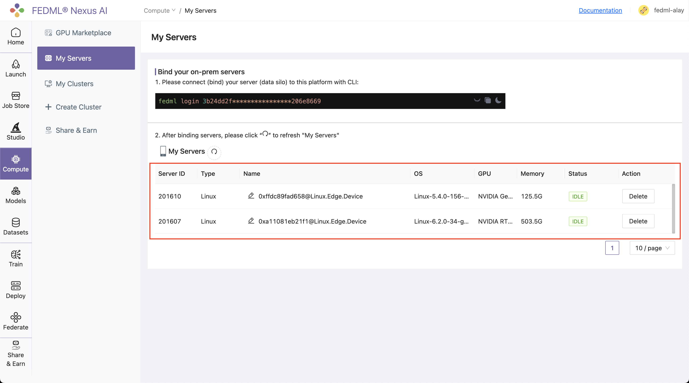
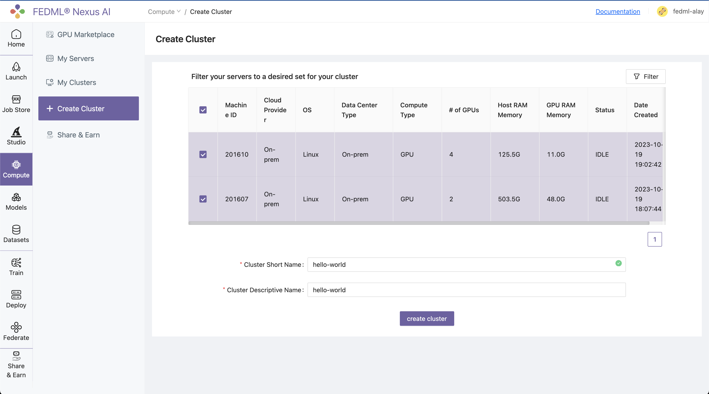
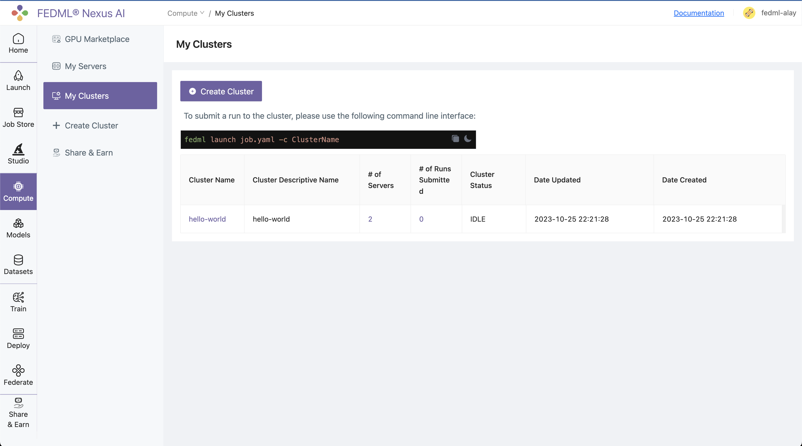

# Launch on On-premise Cluster

## 1: Bind the machines on Platform

### Log into the platform, head to the `Compute / My Servers` Page and copy the fedml login command:


 

### SSH into your on-prem devices and do the following individually for each device:

Install the fedml library if not installed already:

```bash
pip install fedml
```

Run the login command copied from the platform:

```bash
fedml login 3b24dd2f****************206e8669
```

It should something similar as below: 

```bash
(fedml) alay@a6000:~$ fedml login 3b24dd2f9b3e478084c517bc206e8669 -v dev

 Welcome to FedML.ai!
 Start to login the current device to the MLOps (https://tensoropera.ai)...

(fedml) alay@a6000:~$ Found existing installation: fedml 0.8.7
Uninstalling fedml-0.8.7:
  Successfully uninstalled fedml-0.8.7
  Looking in indexes: https://test.pypi.org/simple/, https://pypi.org/simple
Collecting fedml==0.8.8a156
  Obtaining dependency information for fedml==0.8.8a156 from https://test-files.pythonhosted.org/packages/e8/44/06b4773fe095760c8dd4933c2f75ee7ea9594938038fb8293afa22028906/fedml-0.8.8a156-py2.py3-none-any.whl.metadata
  Downloading https://test-files.pythonhosted.org/packages/e8/44/06b4773fe095760c8dd4933c2f75ee7ea9594938038fb8293afa22028906/fedml-0.8.8a156-py2.py3-none-any.whl.metadata (4.8 kB)
Requirement already satisfied: numpy>=1.21 in ./.pyenv/versions/fedml/lib/python3.10/site-packages (from fedml==0.8.8a156
.
.
.
.

Congratulations, your device is connected to the FedML MLOps platform successfully!
Your FedML Edge ID is 201610, unique device ID is 0xffdc89fad658@Linux.Edge.Device
```

Head back to the `Compute / My Servers` page on platform and verify that the devices are bounded to the TensorOpera® AI Platform:




## 2: Create a cluster of your servers bounded to the TensorOpera® AI Platform:

Navigate to the `Compute / Create Clusters` page and create a cluster of your servers:



All your created clusters will be listed on the `Compute / My Clusters` page:




## 3. Set up the fedml library
Install Python library for interacting with TensorOpera® Launch APIs.

```bash
pip install fedml
```


## 4. Create `job.yaml` file

Before launch any job, at first, you need to define your job properties in the job yaml file, e.g. workspace, job, bootstrap, etc.

:::tip Tip
The workspace folder is the folder where your source code for execution resides
:::

For eg, below is the directory structure of `hello_world` demo:

```bash
❯ tree -l 2
▁
/Users/alay/Desktop/FedML/example
├── hello_world
|  ├── hello_world.py
|  └── requirements.txt
└── job.yaml

directory: 1 file: 3
```

`/hello_world` contains all the source code including `requirements.txt` file which contains all the dependencies required to run the `hello_world.py` file.

Hence, the job yaml file for this example would translate to:

```yaml title="job.yaml"
# Local directory where your source code resides.
# It should be the relative path to this job yaml file.
# If your job doesn't contain any source code, it can be empty.
workspace: hello_world

# Bootstrap shell commands which will be executed before running entry commands.
# Support multiple lines, which can be empty.
bootstrap: |
  pip install -r requirements.txt
  echo "Bootstrap finished."


# Running entry commands which will be executed as the job entry point.
# If an error occurs, you should exit with a non-zero code, e.g. exit 1.
# Otherwise, you should exit with a zero code, e.g. exit 0.
# Support multiple lines, which can not be empty.
job: |
    echo "Hello, Here is the launch platform."
    echo "Current directory is as follows."
    pwd
    python hello_world.py  
```

For more details and properties about the job yaml file, please refer to [job yaml file](../yaml).


## 5. Launch the job on your cluster:

All that is left to do to Launch a job to the On-prem Cluster is running following one-line command:

```bash
fedml launch job.yaml -c <cluster_name>
```

For our example, the command and respective output would be as follows:

```bash
fedml launch job.yaml -c hello-world
```


# 6. Run concurrent jobs on cluster.
You can run as many consequent jobs as you like on your cluster now. It will queue the jobs and by default run in the order of submission.


