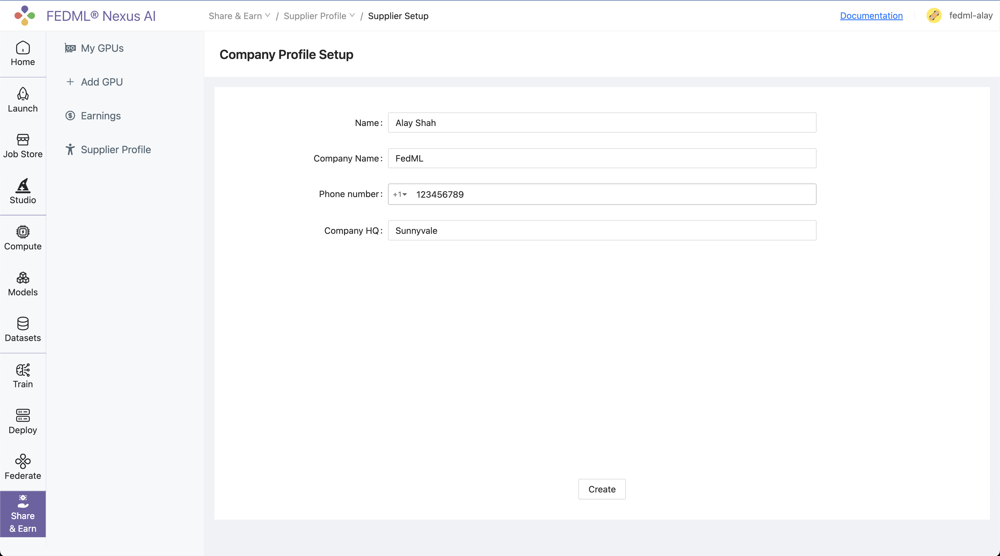
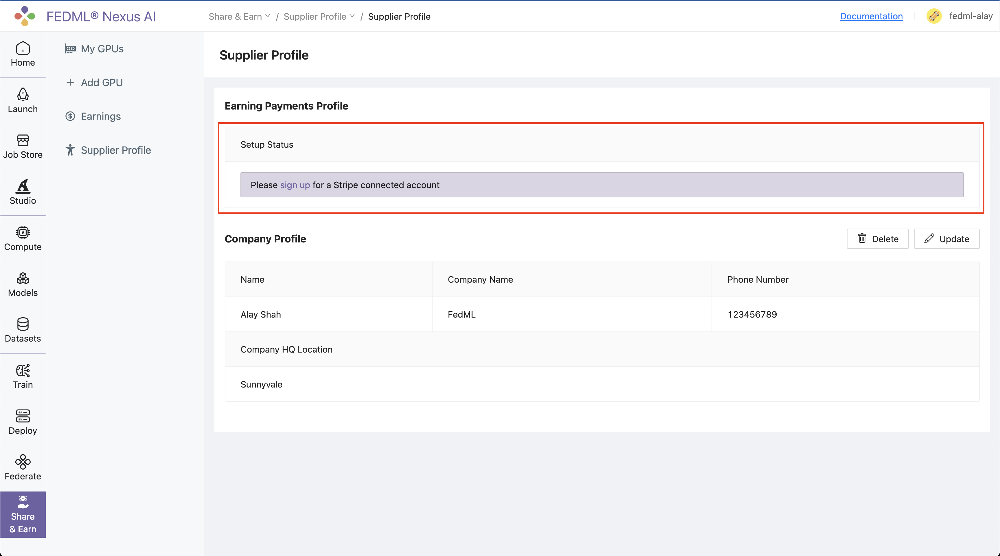
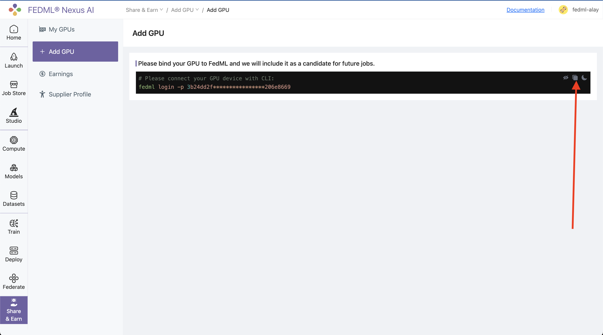
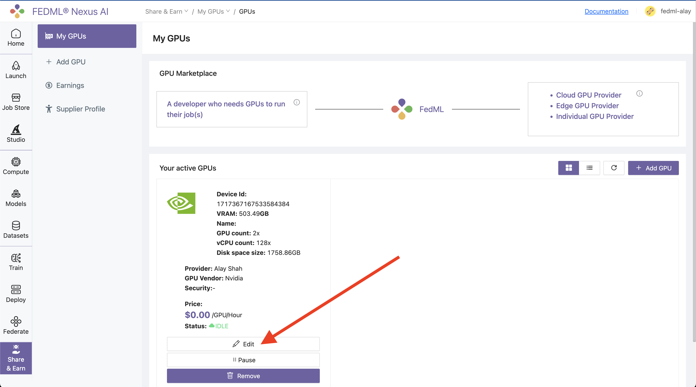
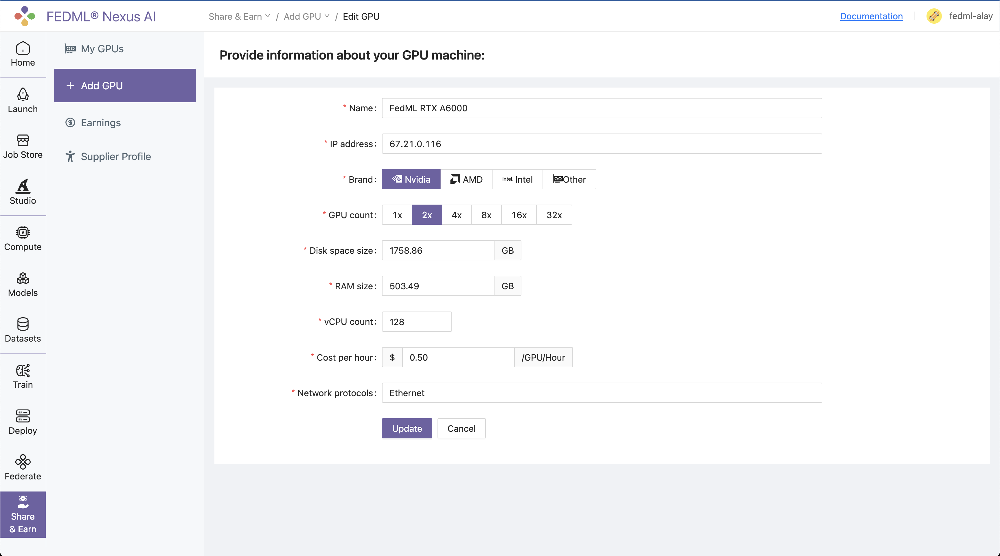
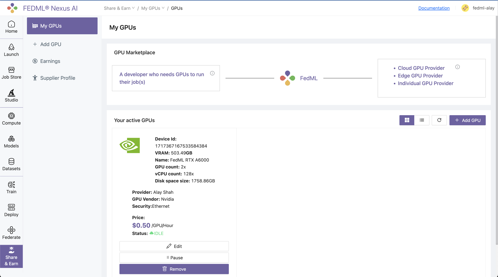

# Share GPUs and Earn

## 1. Supplier Setup 

#### Login to the TensorOpera® AI Platform and navigate to the `Share & Earn / Add GPU` page.



#### Setup Stripe account or just connect if you have one already to get paid by FedML, Inc.




## 2. Add GPUs

#### Navigate to `Share & Earn / Add GPU` page and copy one-line login command for binding your GPU servers.



#### From your GPU server terminal, execute the login command copied in from the platform.

Below is output of command when executed on a TensorOpera® GPU server:

```
(fedml) alay@a6000:~$ fedml login -p 3b24dd2f****************206e8669

 Welcome to FedML.ai!
 Start to login the current device to the TensorOpera AI Platform

(fedml) alay@a6000:~$

Congratulations, your device is connected to the FedML MLOps platform successfully!
Your FedML Edge ID is 1717367167533584384, unique device ID is 0xa11081eb21f1@Linux.Edge.GPU.Supplier

You may visit the following url to fill in more information with your device.
https://tensoropera.ai/gpu-supplier/gpu/edit/1717367167533584384
```

As instructed by the output, next you need to visit the url to fill in more information about your GPU server.


## 3. Fill in GPU server details


#### Navigate to `Share & Earn / My GPUs` page and click on the `Edit` button to fill in more information about your GPU servers.


:::tip Tip
You can also click through or copy the url link in the terminal output of previous step into browser of your choice to directly go to the edit page.
:::




#### Fill in the details of your GPU server and click on `Update` button.

> **Note**: Most info is pre-filled for you. You just need to fill in the `GPU Name` and `Network Protocol` fields and set the cost per hour.

:::tip Tip
Be mindful while deciding Cost per hour for your GPU server. Setting the cost very high may put you at disadvantage as the matching algorithm prioritizes the cheaper GPU servers first.
:::



Head back to the `Share & Earn / My GPUs` page on platform and verify that the GPU server is added to your list of active GPUs:




## 4. Sit back, relax and get paid by FedML, Inc.

Hard part is over, now comes the fun part.

Your GPU server will automatically be added to the resource pool and jobs that match the specifications will be scheduled.


:::tip Tip
All you have to do is sit back, relax and get paid (💵) by FedML, Inc.
:::

You can also monitor your earnings on the `Share & Earn / Earnings` page:


