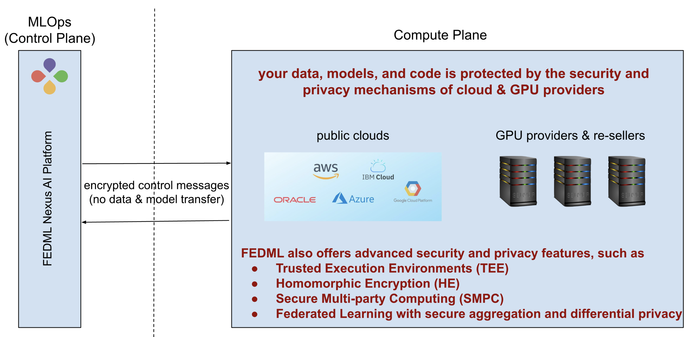
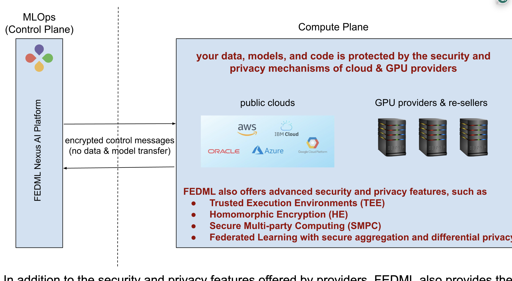

# Security and Privacy 

FEDML Nexus AI offers a variety of security and privacy features to meet the needs of both large enterprises and individual developers.

## 1. On-premises and private cloud deployment

By choosing on-premises or on-private cloud deployment, you can maintain the highest level of control and protection for your data, AI models, and code. Your data, models, and code will always remain within the secure perimeter of your private infrastructure, protecting all sensitive information. As shown in the figure below, FEDML Nexus AI platform will only communicate to your servers through encrypted messages that contain control messages only. FEDML python libraries will be running locally on your servers for orchestrating your training, deployment, and monitoring. 

## 2. On GPU/CPU marketplace deployment (multi-cloud and multi-provider)

Deploying your model, data, and code to the FEDML GPU/CPU marketplace places them within a FEDML container residing in the infrastructure of the GPU/cloud provider. This infrastructure is protected by a wide variety of security and privacy features that most providers adhere to, such as:
- Data Encryption: Both in transit and at rest, with optional customer-managed keys.
- Identity & Access Management: Including multi-factor authentication and role-based access controls.
- Compliance Adherence: Meeting global standards like GDPR and HIPAA, and possessing certifications such as ISO 27001.
Physical Security: Secured data centers with access control and surveillance.
- Network Protection: Firewalls, intrusion detection, and DDoS mitigation.
- Incident Response: 24/7 monitoring, automated threat detection, and mitigation.
- Privacy Assurance: Tools for data management and controls for data sovereignty.
- Maintenance & Updates: Regular security updates and vulnerability patching.
- Security Audits: Frequent third-party security assessments and penetration testing.

If you have specific security and privacy requirements, we can help you schedule your jobs only to providers that comply with those requirements. We can also provide separation between secure public cloud and community cloud, so you can choose which one to use.

In addition to the security and privacy features offered by providers, FEDML also provides the following advanced features:

- **Trusted Execution Environments (TEEs)**, which are secure areas in processors that protect sensitive code and data by isolating them from the main operating system. This isolation protects against software and hardware attacks, even in untrusted environments, making it ideal for handling critical data and cryptographic operations.

- **Homomorphic Encryption (HE)**, which allows computation on encrypted data, generating an encrypted result that, when decrypted, matches the result of the same operations performed on the plaintext (non-encrypted) data. This enables complex data processing in an encrypted domain, ensuring that sensitive data remains secure even during analysis. HE is a powerful tool for preserving privacy in cloud computing, data analysis, and beyond.

- **Secure Multi-Party Computation (SMPC)**, which is a cryptographic protocol that allows compute nodes to jointly compute a function over their inputs while keeping those inputs private. The compute nodes only learn the output of the function, not any of the input data, enabling collaborative computation without compromising the confidentiality of the individual data sets.

- **Federated Learning (FL)** with secure aggregation and differential privacy, which is a machine learning technique that allows multiple nodes to train a shared model without sharing their individual data. This is done by having each bide train a local model on its own private data, and then sending the aggregated updates to a central server. The server then aggregates the updates and uses them to update the global model.

## 3. On hybrid cloud deployment

Using The FEDML Nexus AI offers hybrid cloud deployment that combines a private cloud (or on-premise servers) with one or more public clouds or providers in the GPU/CPU marketplace. Some of the advantages of this approach include:
Flexibility, scalability, and cost-saving: it offers organizations the flexibility to scale their resources up or down as needed. This is because they can use the marketplace to burst their workloads during peak periods, and then scale back down to their private cloud or on-premise servers during off-peak periods. It also enables the use of public clouds and providers in the GPU/CPU marketplace for workloads that are not sensitive or don’t have strict security requirements, and then use private cloud for more sensitive workloads.
Security and compliance control: it helps organizations improve their security and control over their data. This is because they can keep their sensitive data in their private cloud, while using the public clouds and providers in the GPU/CPU marketplace for workloads that are not as sensitive.

