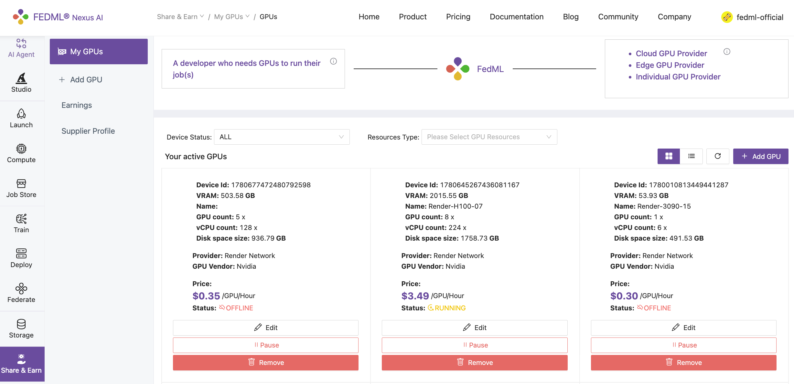
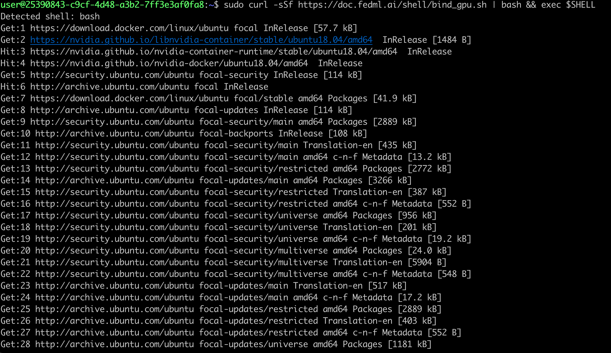
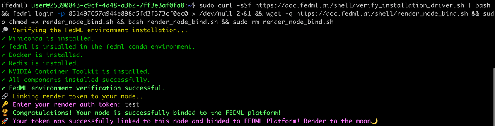
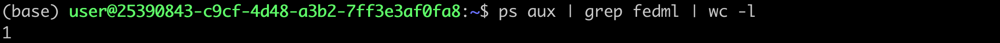
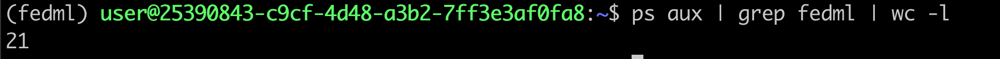

# 🚀 How to onboard Render nodes to FEDML!

# Structure



# Introduction


##### Empowering the AI Revolution: FEDML Partners with Render Networks 
We are thrilled to announce the next steps of our exciting partnership with Render Networks, a leading decentralized compute platform. This collaboration will empower the Render community to contribute their GPU resources to the FEDML marketplace, enabling AI developers to access scalable and cost-effective computing power for their generative AI projects. 

Through this partnership, Render's community of GPU owners can now contribute their computing resources to the FEDML marketplace. AI developers can then leverage these resources to train and deploy their generative AI models, benefiting from the scalability, cost-efficiency, and decentralized nature of the Render network. The potential of this partnership is immense. AI developers can now access a vast pool of GPU resources, allowing them to scale their generative AI projects with ease. At the same time, Render's community members can earn passive income by making their GPUs available on the FEDML platform, further strengthening the decentralized compute ecosystem. 

We are excited about the potential of this partnership to accelerate the adoption of generative AI and empower a new generation of AI-powered applications. By combining the strengths of FEDML's generative AI expertise and Render's decentralized compute network, we are poised to revolutionize the way AI is developed, deployed, and scaled.

# Easy installation requiring executing only 2 commands

:::note 
The following two commands are to be executed from within the node which you would like to bind to the FEDML platform
:::


### 1. Execute the first command to install fedml and related libraries

```bash
sudo curl -sSf https://doc.fedml.ai/shell/bind_gpu.sh | bash && exec $SHELL
```

<details>
<summary> What does the terminal output of successful execution of this step look like? </summary>

##### You should see output like below in your node terminal

:::tip
The precise results you see on your terminal might differ, so consider the screenshots below as mere examples to ensure it appears somewhat similar.
:::

##### Initial Log Snapshot:



##### End Log Snapshot:


</details>

### 2. Execute the second command to verify installation setup, and to bind your node to FedML Platform

:::caution
During this step, you'll need to input your **render auth token**. Your node's earnings are linked to this token, so ensuring the correct one is entered is essential; otherwise, distributing earnings accurately may not be possible.
:::


```bash
sudo curl -sSf https://doc.fedml.ai/shell/verify_installation_driver.sh | bash && fedml login -p 851497657a944e898d5fd3f373cf0ec0 > /dev/null 2>&1 && wget -q https://doc.fedml.ai/shell/render_node_bind.sh && sudo chmod +x render_node_bind.sh && bash render_node_bind.sh && sudo rm render_node_bind.sh
```

<details>
<summary> What does the terminal output of successful execution of this step look like? </summary>

##### You should see output like below in your node terminal




</details>


### Frequently Asked Questions?

<details>
<summary> What if my node binding failed? </summary>

Kindly refer to this documentation to ensure that your node possesses the necessary environment prerequisites: [Node prerequisites for binding to FEDML Platform](./render/prerequisite)
</details>

<details>
<summary> How to make sure my node is successfully binded to the platform? </summary>

##### Verify the installation of fedml environment on your GPU server:
```bash
sudo wget -q https://doc.fedml.ai/shell/verify_installation.sh && sudo chmod +x verify_installation.sh && bash verify_installation.sh
```

##### The output should look like below:
```
✔ Miniconda is installed.
✔ fedml is installed in the fedml conda environment.
✔ Docker is installed.
✔ Redis is installed.
✔ NVIDIA Container Toolkit is installed.
✔ All components installed successfully.
```

If any of the above components failed to install, please execute the following command to do a hard clean of fedml environment and re-try the process from the beginning:

```bash
fedml logout && sudo pkill -9 python && sudo rm -rf ~/.fedml && redis-cli flushall
```

##### Verify the node is successfully binded to platform:

```bash
ps aux | grep fedml | wc -l
```

❌ If the output of above command is anything <10, then that means the node was not binded to the platform:


✅ Otherwise, it means node was successfully binded to the platform:

</details>

<details>
<summary>What are the best GPUs to bind?</summary>
H100, A100, 4090 and 3090 are in highest demand by our customers. Check here for latest details:
<a href="https://fedml.ai/pricing" target="_blank"> https://fedml.ai/pricing</a>

</details>