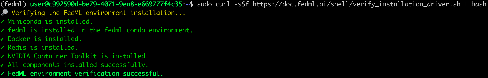
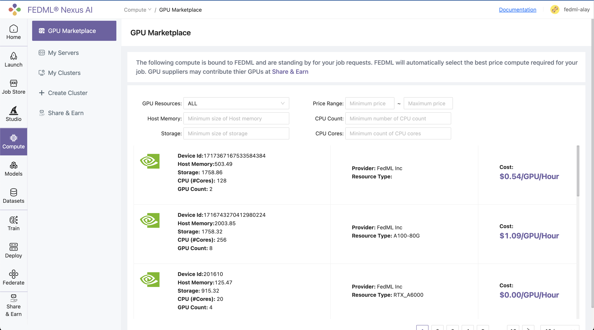
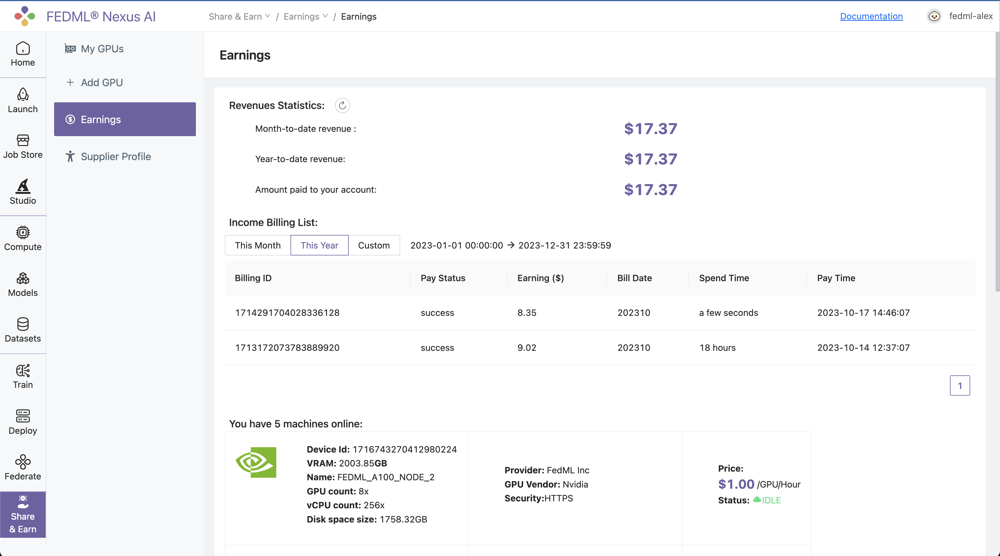

# Share GPUs and Earn

## 1. Supplier Setup 

### 1.1) Login to the FEDML® Nexus AI Platform and navigate to the `Share & Earn / Add GPU` page.


### 1.2) Setup Stripe account or just connect if you have one already to get paid by FedML, Inc.


## 2. Add GPUs

### 2.1) Prerequisites:
Need to have a GPU server with NVIDIA GPU(s) installed and CUDA drivers installed.
To check if nvidia drivers are installed, run the following command:

```bash
nvidia-smi
```

If you see the output with GPU details, you are good to go.

If you don't have nvidia drivers installed, you can first try to install them using the following command:

```bash
sudo ubuntu-drivers autoinstall
sudo apt install nvidia-cuda-toolkit
sudo reboot
nvidia-smi
```

If the above commands don't work, you can follow the instructions on NVIDIA's official website
[here](https://docs.nvidia.com/cuda/cuda-installation-guide-linux/index.html).

### 2.2) Execute the following binding script on your GPU server:

:::note 
The following two commands are to be executed from within the compute nodes which you would like to bind to the FEDML platform
:::


#### 2.2.1) Execute the first command to install fedml and related libraries

```bash
sudo curl -sSf https://doc.fedml.ai/shell/bind_gpu.sh | bash && exec $SHELL
```

<details>
<summary> What does the terminal output of successful execution of this step look like? </summary>

##### You should see output like below in your node terminal

:::tip
The precise results you see on your terminal might differ, so consider the screenshots below as mere examples to ensure it appears somewhat similar.
:::

##### Initial Log Snapshot:


##### End Log Snapshot:


</details>


#### 2.2.2) Verify the installation of fedml library on your GPU server:

```bash
sudo curl -sSf https://doc.fedml.ai/shell/verify_installation_driver.sh | bash
```

The output should look like below:

<details>
<summary> What does the terminal output of successful execution of this step look like? </summary>

##### You should see output like below in your node terminal




</details>


### 2.3) Navigate to `Share & Earn / Add GPU` page and copy one-line login command for binding your GPU servers.


#### From your GPU server terminal, execute the login command copied in from the platform.

Below is output of command when executed on a FedML® GPU server:

```
(fedml) alay@a6000:~$ fedml login -p 3b24dd2f****************206e8669

 Welcome to FedML.ai!
 Start to login the current device to the FedML® Nexus AI Platform

(fedml) alay@a6000:~$

Congratulations, your device is connected to the TensorOpera AI platform successfully!
Your FedML Edge ID is 1717367167533584384, unique device ID is 0xa11081eb21f1@Linux.Edge.GPU.Supplier

You may visit the following url to fill in more information with your device.
https://fedml.ai/gpu-supplier/gpu/edit/1717367167533584384
```

As instructed by the output, next you need to visit the url to fill in more information about your GPU server.


## 3. Fill in GPU server details


### 3.1) Navigate to `Share & Earn / My GPUs` page and click on the `Edit` button to fill in more information about your GPU servers.


:::tip Tip
You can also click through or copy the url link in the terminal output of previous step into browser of your choice to directly go to the edit page.
:::


### 3.2) Fill in the details of your GPU server and click on `Update` button.

> **Note**: Most info is pre-filled for you. You just need to fill in the `GPU Name` and `Network Protocol` fields and set the cost per hour.

:::tip Tip
Be mindful while deciding Cost per hour for your GPU server. Setting the cost very high may put you at disadvantage as the matching algorithm prioritizes the cheaper GPU servers first.
:::


Head back to the `Share & Earn / My GPUs` page on platform and verify that the GPU server is added to your list of active GPUs:


## 4. Sit back, relax and get paid by FedML, Inc.

Hard part is over, now comes the fun part.

Your GPU server will automatically be added to the resource pool and jobs that match the specifications will be scheduled.



:::tip Tip
All you have to do is sit back, relax and get paid (💵) by FedML, Inc.
:::

You can also monitor your earnings on the `Share & Earn / Earnings` page:




## Frequently Asked Questions?

<details>
<summary> What if my node binding failed? </summary>

Kindly refer to this documentation to ensure that your node possesses the necessary environment prerequisites: [Node prerequisites for binding to FEDML Platform](./share-and-earn/prerequisites)
</details>

<details>
<summary> How to make sure my node is successfully binded to the platform? </summary>

##### Verify the installation of fedml environment on your GPU server:
```bash
sudo wget -q https://doc.fedml.ai/shell/verify_installation.sh && sudo chmod +x verify_installation.sh && bash verify_installation.sh
```

##### The output should look like below:
```
✔ Miniconda is installed.
✔ fedml is installed in the fedml conda environment.
✔ Docker is installed.
✔ Redis is installed.
✔ NVIDIA Container Toolkit is installed.
✔ All components installed successfully.
```

If any of the above components failed to install, please execute the following command to do a hard clean of fedml environment and re-try the process from the beginning:

```bash
fedml logout && sudo pkill -9 python && sudo rm -rf ~/.fedml && redis-cli flushall
```

##### Verify the node is successfully binded to platform:

```bash
ps aux | grep fedml | wc -l
```

❌ If the output of above command is anything <10, then that means the node was not binded to the platform:


✅ Otherwise, it means node was successfully binded to the platform:

</details>

<details>
<summary>What are the best GPUs to bind?</summary>
H100, A100, 4090 and 3090 are in highest demand by our customers. Check here for latest details:
<a href="https://fedml.ai/pricing" target="_blank"> https://fedml.ai/pricing</a>

</details>


