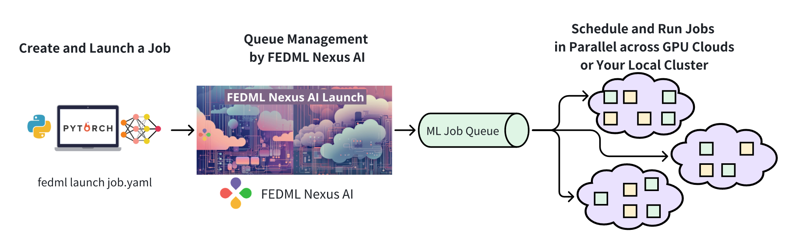

# High Concurrent Batch Job

FEDML Batch Job is for high-concurrency multi-user training job queue management. It can distribute high-concurrency batch training jobs to decentralized GPU clusters, optimize scalability and throughput, and achieve rapid task digestion and high GPU utilization, thereby improving generative AI user experience and GPU cost. The applicable scenarios include:
1. Massive Internet users initiate a large number of fine-tuning or inference tasks in a short time period. 
2. Manage concurrent tasks of team members in the self-hosted GPU cluster.

Note: You are welcome to contact us to support other use cases of larger-scale high-concurrency training tasks.

As shown in the figure, developers only need to launch a large number of jobs through CLI or API such as fedml launch job.yaml, then the FEDML Nexus AI platform is responsible for complex scheduling and experiment management: the FEDML platform will dispatch the jobs into decentralized large-scale GPU clusters. , and consume the queue as quickly as possible.

The feature of tracking experiments for batch jobs is consistent with the normal training job. For more details, please refer to [experimental tracking](./experimental_tracking.md).
