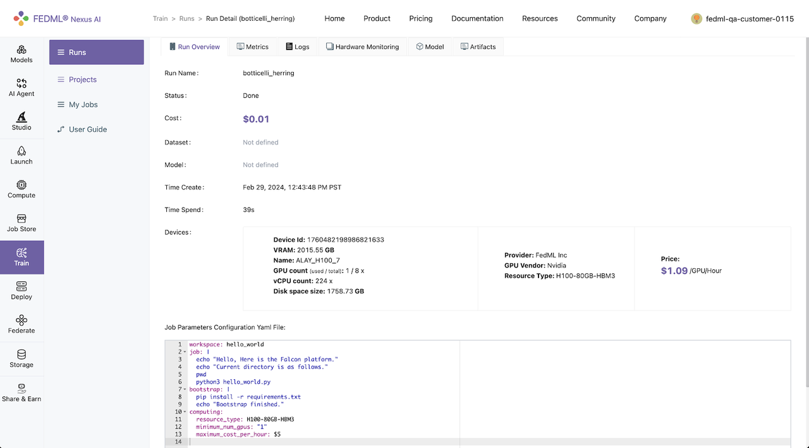
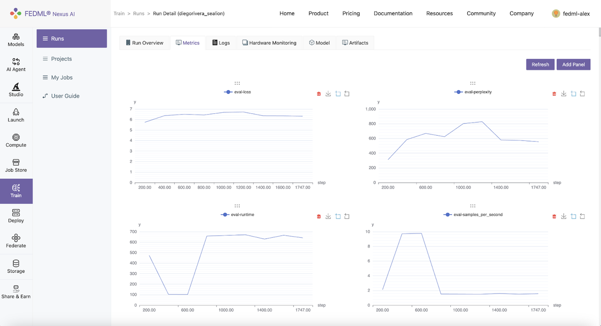
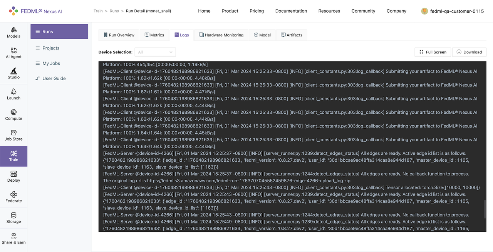
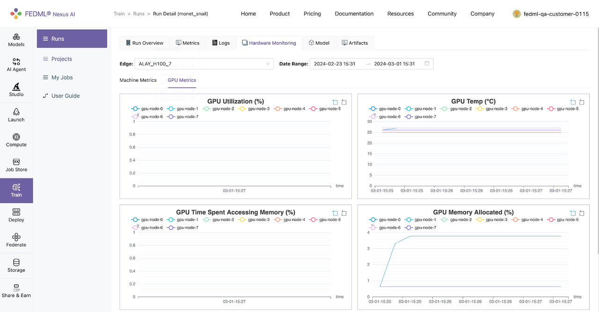
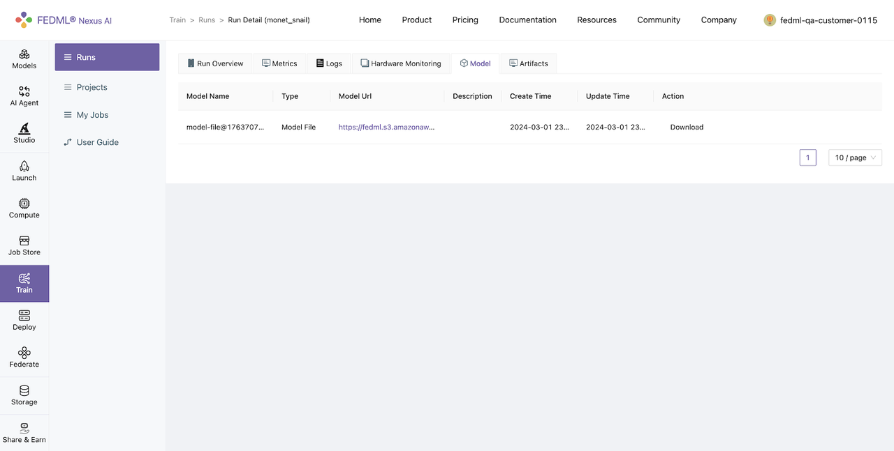
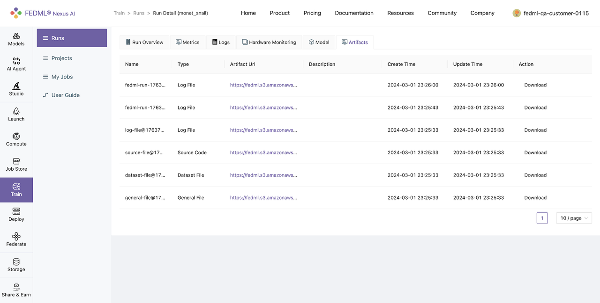

# Experimental Tracking

Running remote tasks often requires a transparent monitoring environment to facilitate troubleshooting and real-time analysis of machine learning experiments. This section guides through the monitoring capabilities of a job launched using the “fedml launch” command.

## Run Overview
Log into to the TensorOpera AI Platform (https://tensoropera.ai) and go to Train > Runs. And select the run you just launched and click on it to view the details of the run.



## Metrics
FedML offers a convenient set of APIs for logging metrics. The execution code can utilize these APIs to log metrics during its operation.

**fedml.log()**

log dictionary of metric data to the TensorOpera AI Platform.

**Usage**

```
fedml.log(
    metrics: dict,
    step: int = None,
    customized_step_key: str = None,
    commit: bool = True) -> None
```

**Arguments**

- metrics (dict): A dictionary object for metrics, e.g., {"accuracy": 0.3, "loss": 2.0}.
- step (int=None): Set the index for current metric. If this value is None, then step will be the current global step counter.
- customized_step_key (str=None): Specify the customized step key, which must be one of the keys in the metrics dictionary.
- commit (bool=True): If commit is False, the metrics dictionary will be saved to memory and won't be committed until commit is True.

**Example:**
```
fedml.log({"ACC": 0.1})
fedml.log({"acc": 0.11})
fedml.log({"acc": 0.2})
fedml.log({"acc": 0.3})

fedml.log({"acc": 0.31}, step=1)
fedml.log({"acc": 0.32, "x_index": 2}, step=2, customized_step_key="x_index")
fedml.log({"loss": 0.33}, customized_step_key="x_index", commit=False)
fedml.log({"acc": 0.34}, step=4, customized_step_key="x_index", commit=True)
```

Metrics logged using fedml.log() can be viewed under Runs > Run Detail > Metrics on TensorOpera AI Platform.




## Logs

You can query the realtime status of your run on your local terminal with the following command.
```
fedml run logs -rid <run_id>
```

Additionally, logs of the run also appear in realtime on the TensorOpera AI Platform under the Runs > Run Detail > Logs




## Hardware Monitoring

The TensorOpera library automatically captures hardware metrics for each run, eliminating the need for user code or configuration. These metrics are categorized into two main groups:
- Machine Metrics: This encompasses various metrics concerning the machine's overall performance and usage, encompassing CPU usage, memory consumption, disk I/O, and network activity.
- GPU Metrics: In environments equipped with GPUs, TensorOpera seamlessly records metrics related to GPU utilization, memory usage, temperature, and power consumption. This data aids in fine-tuning machine learning tasks for optimized GPU-accelerated performance.



## Model

TensorOpera additionally provides an API for logging models, allowing users to upload model artifacts.

**fedml.log_model()**

Log model to the TensorOpera AI Platform (fedml.ai).
```
fedml.log_model(
    model_name, 
    model_file_path, 
    version=None) -> None
```

**Arguments**

- model_name (str): model name.
- model_file_path (str): The file path of model name.
- version (str=None): The version of TensorOpera AI Platform, options: dev, test, release. Default is release (fedml.ai).

**Examples**
```
fedml.log_model("cv-model", "./cv-model.bin")
```
Models logged using fedml.log_model() can be viewed under Runs > Run Detail > Model on TensorOpera AI Platform




## Artifacts:
Artifacts, as managed by TensorOpera, encapsulate information about items or data generated during task execution, such as files, logs, or models. This feature streamlines the process of uploading any form of data to the TensorOpera AI Platform, facilitating efficient management and sharing of job outputs. TensorOpera facilitates the uploading of artifacts to the TensorOpera AI Platform through the following artifact api:

**fedml.log_artifact()**

log artifacts to the TensorOpera AI Platform (fedml.ai), such as file, log, model, etc.

```
fedml.log_artifact(
    artifact: Artifact,
    version=None,
    run_id=None,
    edge_id=None) -> None
```
**Arguments**
- artifact (Artifact): An artifact object represents the item to be logged, which could be a file, log, model, or similar.
- version (str=None): The version of TensorOpera AI Platform, options: dev, test, release. Default is release (fedml.ai).
- run_id (str=None): Run id for the artifact object. Default is None, which will be filled automatically.
- edge_id (str=None): Edge id for current device. Default is None, which will be filled automatically.

Artifacts logged using fedml.log_artifact() can be viewed under Runs > Run Detail > Artifactson TensorOpera AI Platform.

