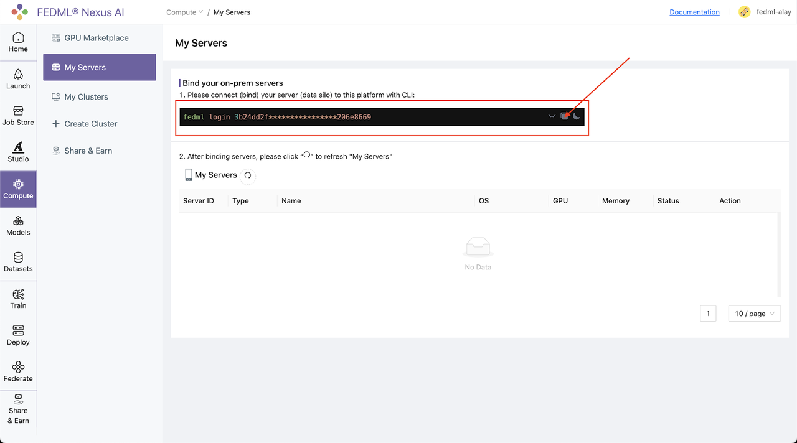
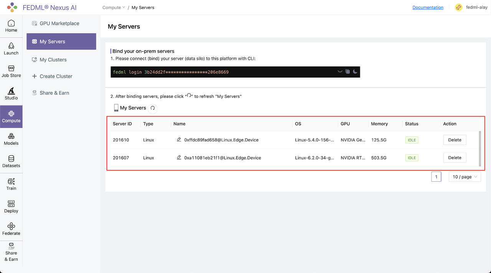
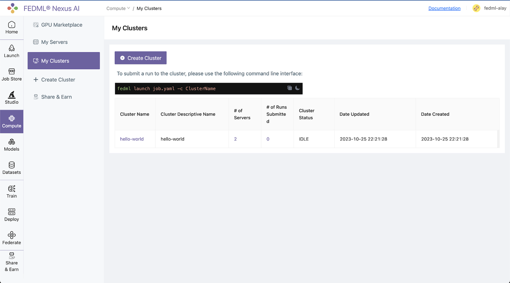

# Train on Your Own On-premise GPU cluster

You can also build your own cluster and launch jobs there. The GPU nodes in the cluster can be GPU instances launched under your AWS/GCP/Azure account or your in-house GPU devices. The workflow is as follows.

## Step 1. Bind the machines on the Platform
Log into the platform, head to the Compute / My Servers Page and copy the fedml login command:



## Step 2. SSH into your on-prem devices and do the following individually for each device:

Install the fedml library if not installed already:
```
pip install fedml
```
Run the login command copied from the platform:
```
fedml login 3b24dd2f****206e8669
```
It should show something similar as below:
```
(fedml) alay@a6000:~$ fedml login 3b24dd2f9b3e478084c517bc206e8669 -v dev

 Welcome to FedML.ai!
 Start to login the current device to the MLOps (https://tensoropera.ai)...

(fedml) alay@a6000:~$ Found existing installation: fedml 0.8.7
Uninstalling fedml-0.8.7:
  Successfully uninstalled fedml-0.8.7
  Looking in indexes: https://test.pypi.org/simple/, https://pypi.org/simple
Collecting fedml==0.8.8a156
  Obtaining dependency information for fedml==0.8.8a156 from https://test-files.pythonhosted.org/packages/e8/44/06b4773fe095760c8dd4933c2f75ee7ea9594938038fb8293afa22028906/fedml-0.8.8a156-py2.py3-none-any.whl.metadata
  Downloading https://test-files.pythonhosted.org/packages/e8/44/06b4773fe095760c8dd4933c2f75ee7ea9594938038fb8293afa22028906/fedml-0.8.8a156-py2.py3-none-any.whl.metadata (4.8 kB)
Requirement already satisfied: numpy>=1.21 in ./.pyenv/versions/fedml/lib/python3.10/site-packages (from fedml==0.8.8a156
.
.
.
.

Congratulations, your device is connected to the TensorOpera AI platform successfully!
Your FedML Edge ID is 201610, unique device ID is 0xffdc89fad658@Linux.Edge.Device
```

Head back to the Compute / My Servers page on platform and verify that the devices are bounded to the TensorOpera AI Platform:



## Step 3. Create a cluster of your servers bounded to the TensorOpera AI Platform:
Navigate to the Compute / Create Clusters page and create a cluster of your servers:


All your created clusters will be listed on the Compute / My Clusters page:




## Step 4. Launch the job on your cluster

The way to create the job YAML file is the same as “Training as a Cloud Service”. All that is left to do to launch a job to the on-premise cluster is to run following one-line command:
```
fedml launch job.yaml -c <cluster_name>
```
For our example, the command and respective output would be as follows:
```
fedml launch job.yaml -c hello-world
```