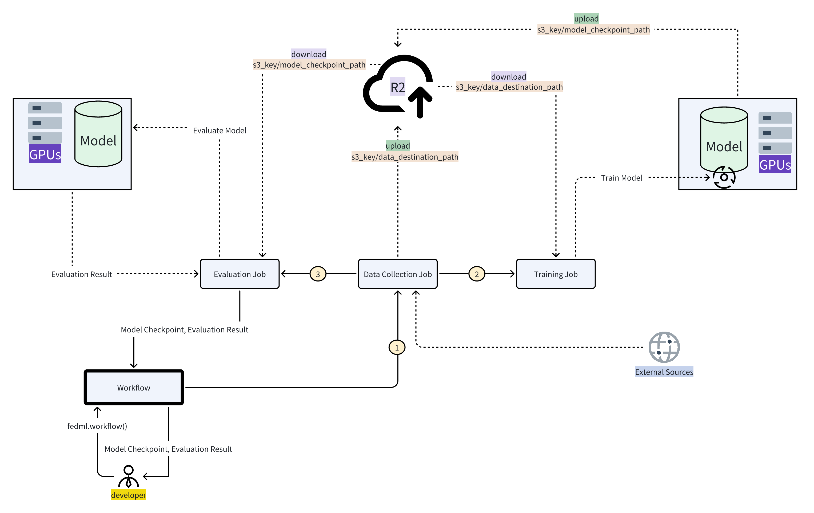

# Compound AI Workflows 


The execution order of the above example workflow will be as follows:

```
loop:
    Execute Job 1
    Execute Job 2 and Job 2 [asynchronously]
    Execute Job 4
```

The example code for connecting jobs using fedml launch can be found here: https://github.com/FedML-AI/FedML/blob/master/python/fedml/workflow/driver_example/main.py

Given below is a barebones template code demonstrating a typical machine learning workflow which starts with data collection followed by model training and evaluation:

```
class DataCollection(Job):
    def __init__(self, name):
        super().__init__(name)

    def run(self):
     # Data collection
     # Data upload
     # Add storage keys to job 
     
    def status(self):
     # fetch job status

    def kill(self):
     # termination code


class Training(Job):
    def __init__(self, name):
        super().__init__(name)

    def run(self):
        # Download Data uploaded by job 1
        # Train model based on collected data by job 1

    def status(self):
     # fetch job status

    def kill(self):
     # termination code
     

class Evaluation(Job):
    def __init__(self, name):
        super().__init__(name)

    def run(self):
        # Download Model and Checkpoints created by Training Job
        # Download Data and evaluate model based on that

    def status(self):
     # fetch job status

    def kill(self):
     # termination code


if __name__ == "__main__":

    # Define Jobs
    data_collection_job = DataCollection(name="data_collection")
    training_job = Training(name="training")
    evaluation_job = Evaluation(name="evaluation")
    
    # Create Workflow
    workflow = Workflow(name="ml_workflow", loop=False)
    workflow.add_job(data_collection_job)
    workflow.add_job(training_job, dependencies=[data_collection_job])
    workflow.add_job(evaluation_job. dependencies=[training_job])
    workflow.set_workflow_input({"S3": "<S3_API_KEY>")
    workflow.run()

```
The journey for users with this workflow goes like this:
- Users start by setting up their data collection, training, and evaluation scripts, and package it as fedml jobs.
- Then link them in the right order using the workflow library
- The workflow figures out the best order to do things and begins with collecting and uploading data. Then it hands off the downloaded data to the training step.
- Training takes the data and trains a model, saving its progress along the way.
- Next, the evaluation job kicks in. It grabs the trained model, evaluates it and returns the evaluation results as the final workflow output



Here's another visual representation of a workflow scenario where two model endpoints are connected. The process begins when the end user interacts with the inference endpoint by providing a prompt. This prompt is initially processed by model 1, and the resulting output serves as the input for another model. Finally, the output from this second model is returned to the user as the final result.

